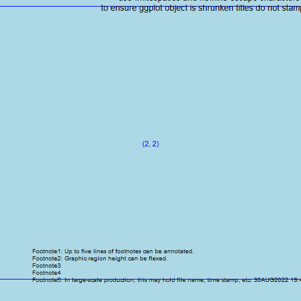
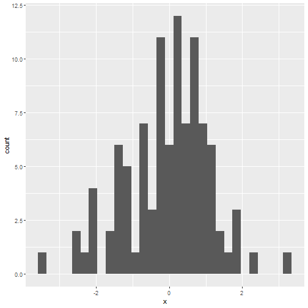
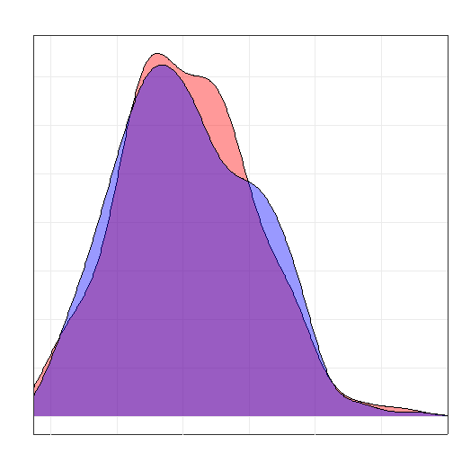
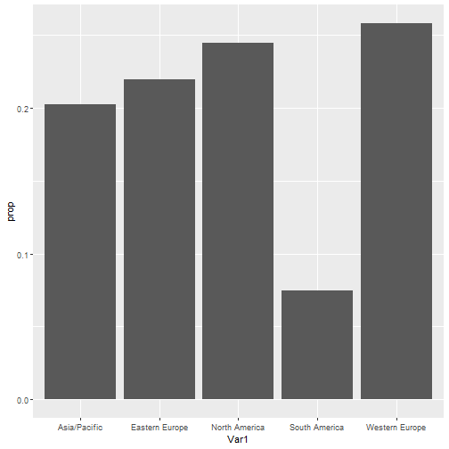
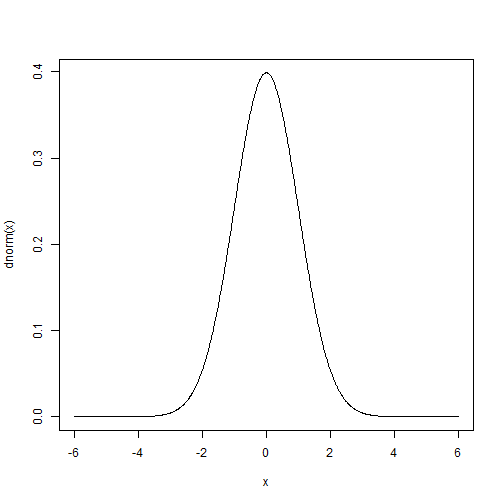

%\VignetteEngine{knitr::knitr}
%\VignetteIndexEntry{Basics: The build.page and annotate.page functions}

# Introduction to the figuRes2 package 

This package takes the view that a figure is a collection of graphs/tables assembled on a page and optionally annotated with metadata (titles, headers and footers). The steps to figure building can then be broken into the following stes:

1. Data importation 
    * typically via appeal to a *validated* data set imported into R as a data.frame
2. Data pre-processing 
    * adjustments to the data set are made to prepare for graphics production. E.g., reformatting levels of factors
3. Graph/table building (with subsequent processing necessary)
    * this creates the graphical elements that will comprise the body of the figure
4. Assembling graph/tables on a page
    * facilitated by the figuRes::build.page function
5. Optional annotation of meta-date to complete the figure. This may include:
    * header notes (typically: protocol number, study population, page number)
    * footer notes (typically: caption notes, date/time stamp of figure production, reference to companion table)
    * title, including figure number

What follows emphasizes the figuRes2 functions that facilitate steps 4 and 5.

# The build.page and annotate.page functions

The build.page function is a wrapper for the gridExtra::grid.arrange function.  It can be used to help visualize how a page will be partitioned. However, its primary purpose is to arrange a list of graphic objects on a page.

## Visualizing page partitioning

Throughout this document we work under the assumption that figures are assembled on an 8.5 x 11 inch page with landscape orientation, though generalizing to other dimensions is straightforward. 

In the simplest case, a single graphic populates the body of the page, i.e., the region of the page allocated to the desired visual display. The defaults of the build.page function allocate predetermined values for left, right, top, and bottom margins. These defaults provide sufficient space for 3 lines of header notes and 5 lines of footnotes presumed by the figuRes2::annotate.page function. By adding a call to annotate.page, we can see how page division looks together with dummy headers and footers.


```r
require(figuRes2)
require(grid)
require(gridExtra)
require(ggplot2)
require(scales)

#pdf("figure1 - testing dimensions.pdf", h=8.5, w=11)
build.page(interior.h=c(1),
           interior.w=c(1),
           ncol=1, nrow=1,
           test.dim=TRUE)
```

```
## Your page is a rectangle: 11 inches wide by 8.5 inches tall.
## Your page setup allocates: 0.75 inches to the left margin.
## Your page setup allocates: 0.75 inches to the right margin.
## Your page setup allocates: 0.9 inches to the top margin.
## Your page setup allocates: 1.25 inches to the bottom margin.
## Your page setup allocates: a rectangle, 9.5 inches wide by 6.35 inches tall for graphics/tables.
```

```r
annotate.page(override="" )
```



```r
#dev.off()
```

Note: Expect distortion when running this code. The ultimate destination is the 8.5 in x 11 in page. Uncomment the pdf and dev.off calls to see what final product looks like. 

RStudio tip: To get a good idea about how a graph will look, from the Plot Pane

* click export
* set width = 1100 and height = 805 (ideally this would be 850)

### Tweaking the arguments of the build.page function

Suppose two graphics are to populate a figure.  E.g., forest plots typically juxtapose a graphic reporting on a stacked collection of confidence intervals with a table to the right or left reporting summary statistics.  In designing a forest plot, one needs to decide how to

* allocate the page's real estate for the graphic, table, and margins, 
* ensure proper alignment of labels, line segments and text, and
* annotate the page with footnotes, headers, etc.

Alternatively, a Kaplan-Meier figure may stack a graphic of the survival curves and a table reporting Number of Subjects at Risk. In this case, it is important to ensure proper alignment of the x-axes. 

In designing forest plot [Kaplan-Meier] figures, we may broadly think of partitioning the page to accomadate a 1x2 [2x1] 'matrix' of graphics components. In thinking about page layout, this matrix, gets padded on top, right, bottom and left by the page margins. The build.page function helps to focus attention on graphic components, while still providing access to margins.  Motivating application will follow.


```r
build.page(interior.h=c(1),
           interior.w=c(.5, .5),
           ncol=2, nrow=1,
           test.dim=TRUE)
```

```
## Your page is a rectangle: 11 inches wide by 8.5 inches tall.
## Your page setup allocates: 0.75 inches to the left margin.
## Your page setup allocates: 0.75 inches to the right margin.
## Your page setup allocates: 0.9 inches to the top margin.
## Your page setup allocates: 1.25 inches to the bottom margin.
## Your page setup allocates: a rectangle, 9.5 inches wide by 6.35 inches tall for graphics/tables.
```

```r
annotate.page(override="")
```


In this example, a 3x1 grid of graphics is planned.


```r
build.page(interior.h=c(1/3,1/3,1/3),
           interior.w=c(1),
           ncol=1, nrow=3,
           test.dim=TRUE)
```

```
## Your page is a rectangle: 11 inches wide by 8.5 inches tall.
## Your page setup allocates: 0.75 inches to the left margin.
## Your page setup allocates: 0.75 inches to the right margin.
## Your page setup allocates: 0.9 inches to the top margin.
## Your page setup allocates: 1.25 inches to the bottom margin.
## Your page setup allocates: a rectangle, 9.5 inches wide by 6.35 inches tall for graphics/tables.
```

```r
annotate.page(override="")
```



An example with unequal allocation: 


```r
build.page(interior.h=c(2, 1, 3)/6,
           interior.w=c(.6, .4),
           ncol=2, nrow=3,
           test.dim=TRUE)
```

```
## Your page is a rectangle: 11 inches wide by 8.5 inches tall.
## Your page setup allocates: 0.75 inches to the left margin.
## Your page setup allocates: 0.75 inches to the right margin.
## Your page setup allocates: 0.9 inches to the top margin.
## Your page setup allocates: 1.25 inches to the bottom margin.
## Your page setup allocates: a rectangle, 9.5 inches wide by 6.35 inches tall for graphics/tables.
```

```r
annotate.page(override="" )
```


### Tweaking the page.heights and page.widths arguments to manipulate graph region

In some applications we might want to manipulate the margins or make them negligible. E.g., suppose a figure is needed exclusively for a PowerPoint presentation and header and footers are not needed. 


```r
build.page(interior.h=c(1/3,1/3,1/3),
           interior.w=c(.5, .5),
           ncol=2, nrow=3,
           test.dim=TRUE,
           top.margin=.1,
           bottom.margin=.1,
           right.margin=.1,
           left.margin=.1)
```


```
## Your page is a rectangle: 11 inches wide by 8.5 inches tall.
## Your page setup allocates: 0.1 inches to the left margin.
## Your page setup allocates: 0.1 inches to the right margin.
## Your page setup allocates: 0.1 inches to the top margin.
## Your page setup allocates: 0.1 inches to the bottom margin.
## Your page setup allocates: a rectangle, 10.8 inches wide by 8.3 inches tall for graphics/tables.
```

Code along the following lines was used in an iterative fashion to land on values of .92 and .165.  Trial and error can be used to fine tune dimensions.  In the first series of figures produced in the pdf, top and bottom margins are set to be large, in the second series, top and bottom margins are shrunk by 0.5 in to increase the region of the page for graphics. 

The value in such an exercise: In large scale figure production, it may be desirable to build figures that dynamically adjust the page layout to based on the number of lines required for titles and footers.  


```r
top.margin=1.6,paste0("bottom margin = ", bm)
```

By working along similar lines, one could determine the build.page and annotate.page margin parameters that would be suited using other page dimension and orientations, e.g., legal page with portrait orientation.

## The plot.margin theme option and its relation to build.page

The figuRes2::default.settings functions includes a call to the following ggplot2 function:

```r
theme_set(theme_grey2_nomargins())
```

```
## Warning: `axis.ticks.margin` is deprecated. Please set `margin` property of
## `axis.text` instead
```

```
## Warning: `panel.margin` is deprecated. Please use `panel.spacing` property
## instead
```

```
## Warning: `legend.margin` must be specified using `margin()`. For the old
## behavior use legend.spacing
```

The figuRes2 package includes a handful of themes which are slight variations on either the ggplot2 default theme, theme\_grey, or theme\_bw.  In particular, theme\_grey2\_default\_margins and theme\_grey2\_nomargins are two variations. Relative to theme_grey these themes have:

* axis.text color changed from "grey50" to "black"
* legend.position changed from "right" to "bottom"
* legend.direction changed to "horizontal"
* theme\_grey2\_default\_margins __retains__: plot.margin = unit(c(1, 1, 0.5, 0.5), "lines")
* theme\_grey2\_nomargins __changes__: plot.margin = unit(c(0, 0, 0, 0), "in")

The default.settings functions sets the theme to theme\_grey2\_nomargins since the build.page function controls global page margins. By setting plot.margins to zero the page real estate available for graphics is maximized relative to the page layout scheme and margins dictated to build.page. Should there be a need to alter the plot.margins of the individual graphics objects being passed to build.page, one can do so within the build of those graphics or by resetting the theme used. 

An example where this might used: Suppose we are juxtaposing two graphics and want to increase the padding between the left and right graphics.  If left.graphic and right.graphic are ggplot graphics built under theme\_grey2\_nomargins, then the following code would give left.graphic and right.graphic padding of 0.1 inches on left and right sides, respectively.  Negative values could also be used used: replacing 0.1 with -0.1 would shrink the padding between the two graphics. Note that this can lead to the second graphic obscuring the first.  


```r
# The vector holds c(top, right, bottom, left) margin measurements. 
left.graphic <- left.graphic + theme(plot.margin=unit(c(0,.1,0,0), "in"))
right.graphic <- right.graphic + theme(plot.margin=unit(c(0,0,0,.1), "in"))
grid.arrange(left.graphic, right.graphic, nrow=1)
```

# Applications of build.page 

In this section we'll populate the page with graphics. First we start a session:


```r
remove(list=ls())
# require(figuRes2)
default.settings(
        my.path = "C:/Users/eri7441//OneDrive - Takeda/Documents/R packages/figuRes2 - testing/",
        od = "C:/Users/eri7441/OneDrive - Takeda/Documents/R packages/figuRes2 - testing/output/",
        dd = "C:/Users/eri7441/OneDrive - Takeda/Documents/R packages/figuRes2 - testing/dddata/",
        cd = "C:/Users/eri7441/OneDrive - Takeda/Documents/R packages/figuRes2 - testing/code/",
        logd = "C:/Users/eri7441/OneDrive - Takeda/Documents/R packages/figuRes2 - testing/log/")

# This code creates directory at the locations specified.
dir.create(file.path(cd), showWarnings = FALSE)
dir.create(file.path(dd), showWarnings = FALSE)
dir.create(file.path(od), showWarnings = FALSE)
dir.create(file.path(logd), showWarnings = FALSE)
```

## Example 1: A bar chart

Some data are manufactured.  A data.frame is built with 

* random standard normals in column 'x', 
* random group categorical variable assignments in column 'group' 
* response variable in column 'y'


```r
set.seed(8675309) # To ensure reproducibility
working.df <- data.frame(x=rnorm(500, 0, 1))
working.df$group <- factor(sample(x=c("A", "B"), replace=TRUE, 
                                  size=nrow(working.df), prob=c(.4,.6)))
working.df$y <- working.df$x + 
  as.numeric(working.df$group)*working.df$x + 
  rnorm(n = nrow(working.df), 0, 3)
```

A simple bar chart is created. 


```r
ex.bar <- ggplot(data=working.df, aes(x=group, fill=group)) + 
  geom_bar() +
  labs(x="Group", y="Frequency", title="", fill="Group") +
  scale_y_continuous(limits=c(0,500), breaks=seq(0,500,25)) +
  coord_flip()
```


```r
print(ex.bar)
```


### Adding annotation

The following call to annotate.page gives a sense of the final product.


```r
build.page(interior.h = c(1), 
           interior.w = c(1),
           ncol=1, 
           nrow=1,
           interior =list(ex.bar + ggtitle("\n\n\n\n")),
           test.dim = F)
annotate.page(override = "")
```


### Sending the graphic to a pdf file and demonstrating how to accomadate multiple title lines

The following code will create a pdf file in your current working directory. Recall that annotate.page is adding the title to the figure.  This series demonstrates that using the newline escape character provides the means by which the graphic is shrunken to accomadate multiple title lines.


```r
pdf(paste0(od, "barchart.pdf"), height=8.5, width=11)
# In the build of ex.bar title="" allows for room for a single title line
build.page(interior.h = c(1), 
           interior.w = c(1),
           ncol=1, 
           nrow=1,
           interior =list(ex.bar))
annotate.page(override = "")
# manipulating the title of the ggplot object allows for two lines
build.page(interior.h = c(1), 
           interior.w = c(1),
           ncol=1, 
           nrow=1,
           interior =list(ex.bar+ggtitle("\n")))
annotate.page(override = "")

# manipulating the title of the ggplot object allows for three lines
build.page(interior.h = c(1), 
           interior.w = c(1),
           ncol=1, 
           nrow=1,
           interior =list(ex.bar+ggtitle("\n\n")))
annotate.page(override = "")
# manipulating the title of the ggplot object allows for four lines

build.page(interior.h = c(1), 
           interior.w = c(1),
           ncol=1, 
           nrow=1,
           interior =list(ex.bar+ggtitle("\n\n\n")))
annotate.page(override = "")
dev.off() # Shuts the pdf device
```

In some applications using the annotate.page function is inconvenient. (See the example above where page margins were shrunken to be negligible.) In these cases, build the title into your ggplot object rather than use blank titles.

## Example 2: Assembling a scatterplot with marginal densities

Initialize a session and generate data similar to the previous bar chart example.


```r
remove(list=ls())
# require(figuRes2) 
default.settings()
```


```r
working.df <- data.frame(x=rnorm(500, 0, 1))
working.df$group <- factor(
  sample(x=c("A", "B"), 
         replace=TRUE, 
         size=nrow(working.df),
         prob=c(.4,.6)))

working.df$y <- working.df$x + 
  as.numeric(working.df$group)*working.df$x + 
  rnorm(n = nrow(working.df), 0, 3)
head(working.df)
```

```
##            x group         y
## 1 -0.4064429     A  3.100391
## 2 -0.3690869     B  3.311304
## 3 -1.5428036     B -1.017126
## 4 -0.2147842     B -6.528522
## 5 -0.1271307     B  2.003076
## 6 -0.8606796     A -4.809386
```

Here's a useful exploratory data analysis figure. The build of main.plot is full of customization; step through the builds. First determine the limits of the data:


```r
xmin <- min(working.df$x)
xmax <- max(working.df$x)
ymin <- min(working.df$y)
ymax <- max(working.df$y)
```

### Building the graphical components

#### Scatterplot

The following build: 

* associates color and shape with group
* alters the size and tranparency of the points
* adds OLS lines with confidence bands
* alters labels
* changes symbols and colors
* manipulates the limits and tick mark locations of the axes
* the expand argument removes padding (remove this argument and contrast result)
* repositions the legend


```r
main.plot <- ggplot(data=working.df, aes(x=x,y=y, color=group, shape=group)) + 
  geom_point(size=3, alpha=.3) +
  geom_smooth(method = "lm", size=.75) +
  labs(x="x values", y="y values", color="Group", shape="Group") +
  scale_shape_manual(values=c(16, 17)) +
  scale_color_manual(values=c("red", "blue"))+
  scale_x_continuous(limits=c(xmin+.5,xmax+.5), breaks=seq(-4,4,1), expand=c(0,0))+
  scale_y_continuous(limits=c(ymin+.5,ymax+.5), expand=c(0,0))+
  theme(legend.position=c(.15, .8))
  
print(main.plot)
```

```
## `geom_smooth()` using formula 'y ~ x'
```

```
## Warning: Removed 5 rows containing non-finite values (stat_smooth).
```

```
## Warning: Removed 5 rows containing missing values (geom_point).
```


#### Density plot for x-values
This chunk creates densities for the x-values, suppressing labels.


```r
density.plot.x <- ggplot(data=working.df, aes(x=x, fill=group, shape=group)) + 
  geom_density(alpha=.4) +
  scale_fill_manual(values=c("red", "blue"))+
  scale_x_continuous(limits=c(xmin+.5,xmax+.5), expand=c(0,0))+
  theme(axis.text=element_text(color="white"),
        axis.ticks=element_line(color="white")) +
  labs(x=NULL, y="", title="\n") +
  guides(fill=FALSE)
```

```
## Warning: `guides(<scale> = FALSE)` is deprecated. Please use `guides(<scale> =
## "none")` instead.
```

```r
print(density.plot.x)
```

```
## Warning: Removed 5 rows containing non-finite values (stat_density).
```



#### Rotated density plot for y-values

This chunk creates densities for the y-values, suppressing labels and rotating the graphic. Note the use of ggplot2::coord_flip.


```r
density.plot.y <- ggplot(data=working.df, aes(x=y, fill=group, shape=group)) + 
  geom_density(alpha=.4) +
    scale_fill_manual(values=c("red", "blue"))+
  theme(axis.text=element_text(color="white"), 
        axis.ticks=element_line(color="white")) +
  scale_x_continuous(limits=c(ymin+.5,ymax+.5), expand=c(0,0))+
  labs(x=NULL, y="") +
  guides(fill=FALSE) +
  coord_flip()
```

```
## Warning: `guides(<scale> = FALSE)` is deprecated. Please use `guides(<scale> =
## "none")` instead.
```

```r
print(density.plot.y)
```

```
## Warning: Removed 1 rows containing non-finite values (stat_density).
```


#### Assembly of figure

Here's the planned layout:


```r
build.page(interior.h = c(.35, .65), 
           interior.w = c(.75, .25),
           ncol=2, 
           nrow=2,
           test.dim = TRUE)
```



```
## Your page is a rectangle: 11 inches wide by 8.5 inches tall.
## Your page setup allocates: 0.75 inches to the left margin.
## Your page setup allocates: 0.75 inches to the right margin.
## Your page setup allocates: 0.9 inches to the top margin.
## Your page setup allocates: 1.25 inches to the bottom margin.
## Your page setup allocates: a rectangle, 9.5 inches wide by 6.35 inches tall for graphics/tables.
```


The three graphics are now assembled and annotated to complete the figure. Note that object blankPanel is an object placed in the global environment by figuRes2::default.settings.


```r
# blankPanel <- grid.rect(gp=gpar(col="white"), draw=FALSE) # created by default.settings
build.page(interior.h = c(.35, .65), 
           interior.w = c(.75, .25),
           ncol=2, 
           nrow=2,
           interior =list(
             density.plot.x, blankPanel, 
             main.plot, density.plot.y))
```

```
## Warning: Removed 5 rows containing non-finite values (stat_density).
```

```
## `geom_smooth()` using formula 'y ~ x'
```

```
## Warning: Removed 5 rows containing non-finite values (stat_smooth).
```

```
## Warning: Removed 5 rows containing missing values (geom_point).
```

```
## Warning: Removed 1 rows containing non-finite values (stat_density).
```

```r
annotate.page(override = "", title=list("Title Line 1", "","","",""))
```


Note: There is still white space between the main plot and the density plots.  This can be reduced by manipulating the plot.margins and using negative values.  The values chosen were obtained via trial and error.


```r
build.page(interior.h = c(.35, .65), 
           interior.w = c(.75, .25),
           ncol=2, 
           nrow=2,
           interior =list(
             density.plot.x+
               theme(plot.margin= unit(c(0, -.1, -.1, 0), unit="in")),
             blankPanel, 
             main.plot+theme(plot.margin=unit(c(-.1, -.1, 0, 0), unit="in")),
             density.plot.y + theme(plot.margin=unit(c(-.1, 0, 0, -.3), 
                                                     unit="in"))))
```

```
## Warning: Removed 5 rows containing non-finite values (stat_density).
```

```
## `geom_smooth()` using formula 'y ~ x'
```

```
## Warning: Removed 5 rows containing non-finite values (stat_smooth).
```

```
## Warning: Removed 5 rows containing missing values (geom_point).
```

```
## Warning: Removed 1 rows containing non-finite values (stat_density).
```

```r
annotate.page(override = "", title=list("Title Line 1", "","","",""))
```



The following code offers a comparison of the graphic in a pdf. 


```r
pdf(file = paste0(od, "scatterplot with marginal densities.pdf"), width = 11, height = 8.5)
# blankPanel <- grid.rect(gp=gpar(col="white"), draw=FALSE) # created by default.settings
build.page(interior.h = c(.35, .65), 
           interior.w = c(.75, .25),
           ncol=2, 
           nrow=2,
           interior =list(
             density.plot.x, blankPanel, 
             main.plot, density.plot.y))
annotate.page(override = "", title=list("Title Line 1", "","","",""))

build.page(interior.h = c(.35, .65), 
           interior.w = c(.75, .25),
           ncol=2, 
           nrow=2,
           interior =list(
             density.plot.x+
               theme(plot.margin= unit(c(0, -.1, -.1, 0), unit="in")),
             blankPanel, 
             main.plot+theme(plot.margin=unit(c(-.1, -.1, 0, 0), unit="in")),
             density.plot.y + theme(plot.margin=unit(c(-.1, 0, 0, -.3), 
                                                     unit="in"))))
annotate.page(override = "", title=list("Title Line 1", "","","",""))
dev.off()
```

