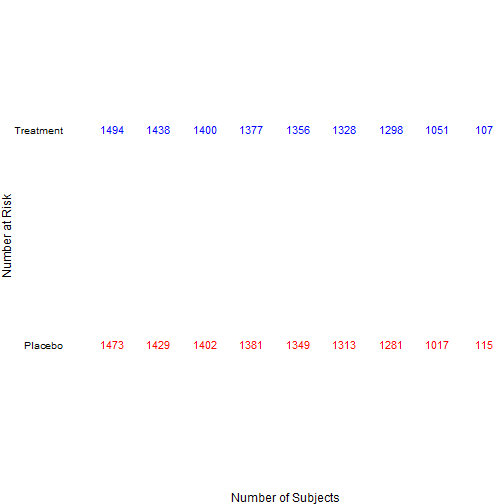
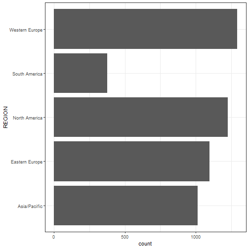
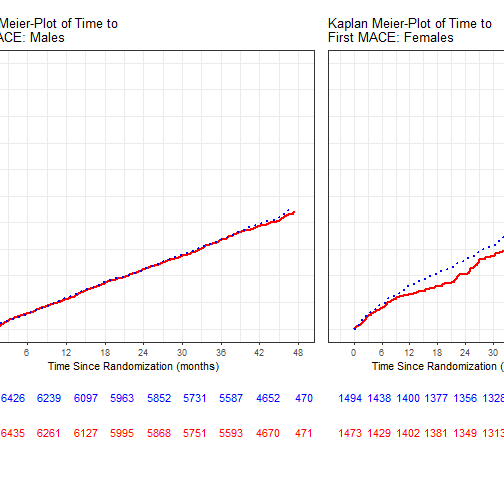
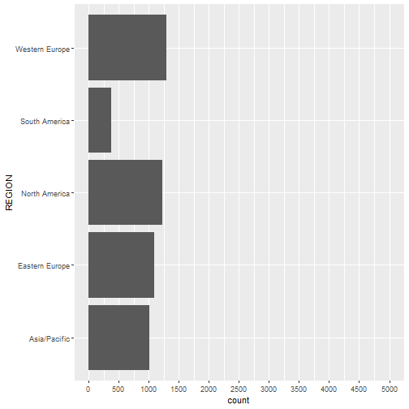
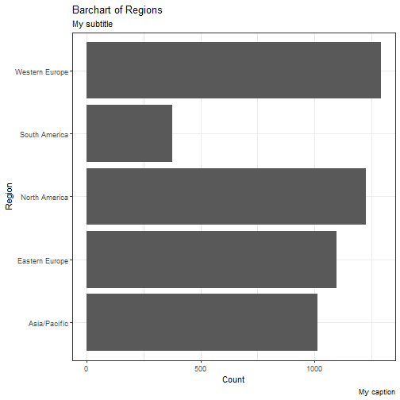
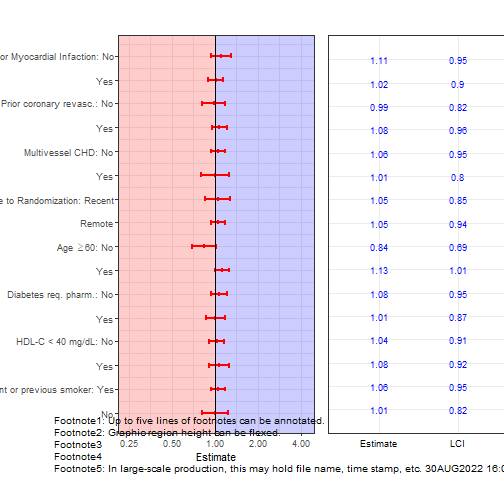
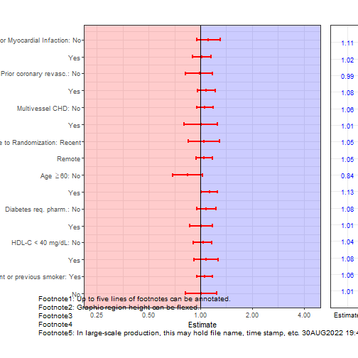

%\VignetteEngine{knitr::knitr}
%\VignetteIndexEntry{The forest.plot and table.plot functions}


# The figures2::forest.plot and figures2::table.plot functions

The forest.plot, dot.plot and table.plot functions share some similarities. These are simple figures to describe, but labeling, idiosyncrasies in data structure, and aesthetic considerations complicate their construction. To get these figures to look appealing, one must have a good understanding of the incoming data structure and iterate towards a final product. These can be very time consuming in terms of design and execution.

This first example will demonstrate that pre-processing and post-processing are essential steps. First, start a session:


```r
remove(list=ls())
require(figures2)
```

```
## Loading required package: figures2
```

```
## 
## Attaching package: 'figures2'
```

```
## The following objects are masked from 'package:figuRes2':
## 
##     annotate.page, bar.plot, box.plot, build.page, cdf.plot,
##     default.settings, dot.plot, facetAdjust, forest.plot, gcurve,
##     get.top.xaxis, graphic.params, km.plot, nsubj.plot,
##     refresh.outputplan, run.specific, start.session.log,
##     stop.session.log, sync.ylab.widths, table.plot,
##     theme_bw2_default_margins, theme_bw2_nomargins,
##     theme_grey2_default_margins, theme_grey2_nomargins,
##     theme_table_nomargins
```

```r
require(survival)
```

```
## Loading required package: survival
```

```r
require(ggplot2)
require(scales)
require(stringr)
```

```
## Loading required package: stringr
```

```r
require(plyr)
```

```
## Loading required package: plyr
```

```r
require(grid)
require(gridExtra)
require(reshape2)
```

```
## Loading required package: reshape2
```

```r
require(gtable)
```

```
## Loading required package: gtable
```

```r
default.settings()
```

## Example 1: Labels for each line segments

Suppose we are handed the following data set with the task of producing a 1x2 panel of 2 graphics - a forest plot on the left and a table plot on the left. Let's inspect the data:


```r
data(forest.data)
working.df <- forest.data
head(working.df)
```

```
##     n1   n2  e1        p1  e2        p2   hr  low high intchi level
## 1 3252 3253 278  8.548585 308  9.468183 1.11 0.95 1.31  0.382    No
## 2 4656 4667 493 10.588488 502 10.756375 1.02 0.90 1.15  0.382   Yes
## 4 2002 1963 240 11.988012 232 11.818645 0.99 0.82 1.18  0.393    No
## 5 5906 5957 531  8.990857 578  9.702871 1.08 0.96 1.22  0.393   Yes
## 7 6706 6732 625  9.320012 663  9.848485 1.06 0.95 1.19  0.668    No
## 8 1202 1188 146 12.146423 147 12.373737 1.01 0.80 1.26  0.668   Yes
##                             subgroup
## 1              Qual. diag.: Prior MI
## 2              Qual. diag.: Prior MI
## 4 Qual. diag.: Prior Coronary Revas.
## 5 Qual. diag.: Prior Coronary Revas.
## 7       Qual. diag.: Multivessel CHD
## 8       Qual. diag.: Multivessel CHD
```

```r
dim(working.df)
```

```
## [1] 89 12
```

We have a data.frame with 89 rows and 35 different subgroup analyses.  Clearly, 89 line segments on a single page would be a bit too much.  Suppose we plan to have 15-20 rows displayed on figures and therefore will ultimately need to partition this dataset into 5 or 6 smaller data.frames. For the present example then, we work with the first 16 rows. Determining how to divide up the remaining rows is an exercise left to the reader.  

Our smaller working data.frame becomes:


```r
working.df.1 <- working.df[1:16,]
working.df.1 
```

```
##      n1   n2  e1        p1  e2        p2   hr  low high intchi  level
## 1  3252 3253 278  8.548585 308  9.468183 1.11 0.95 1.31  0.382     No
## 2  4656 4667 493 10.588488 502 10.756375 1.02 0.90 1.15  0.382    Yes
## 4  2002 1963 240 11.988012 232 11.818645 0.99 0.82 1.18  0.393     No
## 5  5906 5957 531  8.990857 578  9.702871 1.08 0.96 1.22  0.393    Yes
## 7  6706 6732 625  9.320012 663  9.848485 1.06 0.95 1.19  0.668     No
## 8  1202 1188 146 12.146423 147 12.373737 1.01 0.80 1.26  0.668    Yes
## 10 1914 1906 178  9.299896 185  9.706191 1.05 0.85 1.29  0.972 Recent
## 11 5972 5999 592  9.912927 624 10.401734 1.05 0.94 1.18  0.972 Remote
## 13 2140 2131 200  9.345794 169  7.930549 0.84 0.69 1.03  0.014     No
## 14 5768 5789 571  9.899445 641 11.072724 1.13 1.01 1.26  0.014    Yes
## 16 5279 5198 441  8.353855 468  9.003463 1.08 0.95 1.23  0.522     No
## 17 2629 2722 330 12.552301 342 12.564291 1.01 0.87 1.18  0.522    Yes
## 19 5173 5218 481  9.298280 503  9.639709 1.04 0.91 1.17  0.664     No
## 20 2734 2698 289 10.570593 305 11.304670 1.08 0.92 1.27  0.664    Yes
## 22 6239 6286 601  9.632954 637 10.133630 1.06 0.95 1.18  0.708     No
## 23 1635 1593 166 10.152905 165 10.357815 1.01 0.82 1.25  0.708    Yes
##                                      subgroup
## 1                       Qual. diag.: Prior MI
## 2                       Qual. diag.: Prior MI
## 4          Qual. diag.: Prior Coronary Revas.
## 5          Qual. diag.: Prior Coronary Revas.
## 7                Qual. diag.: Multivessel CHD
## 8                Qual. diag.: Multivessel CHD
## 10       Time from CHD event to randomization
## 11       Time from CHD event to randomization
## 13              CV risk factor: Age>=60 years
## 14              CV risk factor: Age>=60 years
## 16       CV risk factor: Diabetes req. pharm.
## 17       CV risk factor: Diabetes req. pharm.
## 19            CV risk factor: HDL-C <40 mg/dL
## 20            CV risk factor: HDL-C <40 mg/dL
## 22 CV risk factor: Current or previous smoker
## 23 CV risk factor: Current or previous smoker
```

Suppose this data.frame is sorted as we'd like to see it in the forest plot. (If not, accomplish this with additional pre-processing!) Namely, we'd like the top rows reporting line segments associated with _Qual. diag.: Prior MI_ and the bottoms rows reporting line segments for _CV risk factor: Current or previous smoker_. The lower and upper endpoints of the line segments are associated with columns low and high containing the endpoints of 95% confidence intervals for the hazard ratio.  The following items need to be added to the data.frame in order to make use of the forest.plot, table.plot and dot.plot functions.  Columns need to be created for the following aspects of the graph:

* rank at which line segments are plotted
* color to be associated with the line segments and points
* ranks for the y-axis labels
* labels for the y-axis

First, we assign ranks for the line segments.


```r
working.df.1$rank <- rev(1:16)
```

Next we assign a column for color.  In this example, the color of all line segments will be the same, so we are creating a dummy column holding a factor with a single value.  (In the next example, we'll see multiple colors.)


```r
working.df.1$category <- factor(0)
```

In this example, each line segment will have a label associated with it. As such, the following step is superfluous; we could just as well reuse the rank column.


```r
working.df.1$label.rank <- rev(1:16)
```

The actual labels to be used can be deduced from the data.frame. These will need to be a combination of values from subgroup and level columns.   


```r
working.df.1$labels <- paste(working.df.1$subgroup, working.df.1$level)
working.df.1
```

```
##      n1   n2  e1        p1  e2        p2   hr  low high intchi  level
## 1  3252 3253 278  8.548585 308  9.468183 1.11 0.95 1.31  0.382     No
## 2  4656 4667 493 10.588488 502 10.756375 1.02 0.90 1.15  0.382    Yes
## 4  2002 1963 240 11.988012 232 11.818645 0.99 0.82 1.18  0.393     No
## 5  5906 5957 531  8.990857 578  9.702871 1.08 0.96 1.22  0.393    Yes
## 7  6706 6732 625  9.320012 663  9.848485 1.06 0.95 1.19  0.668     No
## 8  1202 1188 146 12.146423 147 12.373737 1.01 0.80 1.26  0.668    Yes
## 10 1914 1906 178  9.299896 185  9.706191 1.05 0.85 1.29  0.972 Recent
## 11 5972 5999 592  9.912927 624 10.401734 1.05 0.94 1.18  0.972 Remote
## 13 2140 2131 200  9.345794 169  7.930549 0.84 0.69 1.03  0.014     No
## 14 5768 5789 571  9.899445 641 11.072724 1.13 1.01 1.26  0.014    Yes
## 16 5279 5198 441  8.353855 468  9.003463 1.08 0.95 1.23  0.522     No
## 17 2629 2722 330 12.552301 342 12.564291 1.01 0.87 1.18  0.522    Yes
## 19 5173 5218 481  9.298280 503  9.639709 1.04 0.91 1.17  0.664     No
## 20 2734 2698 289 10.570593 305 11.304670 1.08 0.92 1.27  0.664    Yes
## 22 6239 6286 601  9.632954 637 10.133630 1.06 0.95 1.18  0.708     No
## 23 1635 1593 166 10.152905 165 10.357815 1.01 0.82 1.25  0.708    Yes
##                                      subgroup rank category label.rank
## 1                       Qual. diag.: Prior MI   16        0         16
## 2                       Qual. diag.: Prior MI   15        0         15
## 4          Qual. diag.: Prior Coronary Revas.   14        0         14
## 5          Qual. diag.: Prior Coronary Revas.   13        0         13
## 7                Qual. diag.: Multivessel CHD   12        0         12
## 8                Qual. diag.: Multivessel CHD   11        0         11
## 10       Time from CHD event to randomization   10        0         10
## 11       Time from CHD event to randomization    9        0          9
## 13              CV risk factor: Age>=60 years    8        0          8
## 14              CV risk factor: Age>=60 years    7        0          7
## 16       CV risk factor: Diabetes req. pharm.    6        0          6
## 17       CV risk factor: Diabetes req. pharm.    5        0          5
## 19            CV risk factor: HDL-C <40 mg/dL    4        0          4
## 20            CV risk factor: HDL-C <40 mg/dL    3        0          3
## 22 CV risk factor: Current or previous smoker    2        0          2
## 23 CV risk factor: Current or previous smoker    1        0          1
##                                            labels
## 1                        Qual. diag.: Prior MI No
## 2                       Qual. diag.: Prior MI Yes
## 4           Qual. diag.: Prior Coronary Revas. No
## 5          Qual. diag.: Prior Coronary Revas. Yes
## 7                 Qual. diag.: Multivessel CHD No
## 8                Qual. diag.: Multivessel CHD Yes
## 10    Time from CHD event to randomization Recent
## 11    Time from CHD event to randomization Remote
## 13               CV risk factor: Age>=60 years No
## 14              CV risk factor: Age>=60 years Yes
## 16        CV risk factor: Diabetes req. pharm. No
## 17       CV risk factor: Diabetes req. pharm. Yes
## 19             CV risk factor: HDL-C <40 mg/dL No
## 20            CV risk factor: HDL-C <40 mg/dL Yes
## 22  CV risk factor: Current or previous smoker No
## 23 CV risk factor: Current or previous smoker Yes
```

We will return to fine tuning these labels in post-processing because of the need for mathematical symbol for _less than or equal to_; in the absence of this issue, an alternative attack would be to coerce the labels column into a factor and rename the levels at this stage.

### Building the forest plot graphic


```r
p1 <- forest.plot(parent.df = working.df.1, 
            y.rank.col = "rank",  # line segment's y-axis rank
            Point.Est = "hr",     # line segment's dot
            lower.lim = "low",     # line segment's lower endpoint
            upper.lim = "high",    # line segment's upper endpoint
            y.label.rank.col = "label.rank",  # label's y-axis rank
            y.label.col = "labels", # label's text value
            x.label = "Estimate", 
            y.label = NULL,
            log.trans = TRUE, 
            x.limits = c(0.21, 5), 
            x.ticks = 2^(-2:2), 
            category.color = "category", # This colors the points and line segments
            background.palette = c("red", "blue"), 
            category.palette = c("red", "blue"), 
            shape.palette = c(16, 16), 
            flip.palette = FALSE) 
```

```
## y.limits are set to NULL; defaults are used.
```

```
## Warning: Ignoring unknown aesthetics: x
```

```r
print(p1)
```



### Post-processing the forest plot graphic
The following is a necessarily manual task.

```r
p2 <- p1 + scale_y_continuous(
  breaks = p1$data$LABEL.RANKS,
  labels = c(
    "Prior Myocardial Infaction: No",
    "Yes",
    "Prior coronary revasc.: No",
    "Yes",
    "Multivessel CHD: No",
    "Yes",
    "CHD Event Relative to Randomization: Recent",
    "Remote",
    expression(paste("Age ", phantom() >= 60,": No")),
    "Yes",
    "Diabetes req. pharm.: No",
    "Yes",
    "HDL-C < 40 mg/dL: No",
    "Yes",
    "Current or previous smoker: Yes",
    "No"))
```

```
## Scale for 'y' is already present. Adding another scale for 'y', which will
## replace the existing scale.
```

```r
print(p2)
```




### Building the table plot graphic
We turn to the corresponding table plot.

```r
t1 <- table.plot(
    parent.df = working.df.1,
    y.rank.col= "rank",
    category.color= "category",
    text.col1 = "hr",
    text.col2 = "low",
    text.col3 = "high",
    text.col4 = NULL,
    text.size = 3,
    xtick.labs = c("Estimate", "LCI", "UCI"),
    x.label= "Text",
    y.label= "Item",
    y.label.rank.col = "label.rank",  #  this identifies the y-axis values for labels
    y.label.col = "subgroup", 
    category.palette = c("red", "blue"))
```

```
## y.limits are set to NULL; defaults are used.
## x.limits are set to NULL; defaults are used.
```

```r
print(t1)
```



Since we're planning to juxtapose the table plot and the forest plot, we can suppress the labels here.  In practice, it is worth verifying that labels in the forest and table plots agree before suppressing the labels. Note that arguments associated with y.label and y.label.rank.col are simply set to NULL. In addition teh x.label is set to white space.  (A good exercise is to see what results when you step through the remainder of this exercise with NULL used in place of white space in the x.label argument.) Finally, the category.palette's first argument is changed from red to grey40.

```r
t2 <- table.plot(
    parent.df = working.df.1,
    y.rank.col= "rank",
    category.color= "category",
    text.col1 = "hr",
    text.col2 = "low",
    text.col3 = "high",
    text.col4 = NULL,
    text.size=3,
    xtick.labs = c("Estimate", "LCI", "UCI"),
    x.label= "",
    y.label=NULL,
    y.label.rank.col = "label.rank",  #  this identifies the y-axis values for labels
    y.label.col = NULL, 
    category.palette = c("grey40", "blue"))
```

```
## y.limits are set to NULL; defaults are used.
## x.limits are set to NULL; defaults are used.
```

```r
print(t2)
```




### Assembling the page
Here's a first pass at assembling the forest plot figure, allocating 50% of available width to the forest plot graphic and table plot raphic.

```r
build.page(interior.h = c(1),
           interior.w = c(1/2, 1/2),
           ncol=2, nrow=1, interior=list(p2+ggtitle(""), t2+ggtitle("")) )
annotate.page(override = "", title=list("Title Line 1", "","","",""))
```



Perhaps allocating more space for the figure and less space for the table would look better:


```r
build.page(interior.h = c(1),
           interior.w = c(.6, .4),
           ncol=2, nrow=1, interior=list(p2+ggtitle(""), t2+ggtitle("")) )
annotate.page(override = "", title=list("Title Line 1", "","","",""))
```



Pushing to an extreme.

```r
build.page(interior.h = c(1),
           interior.w = c(.8, .2),
           ncol=2, nrow=1, interior=list(p2+ggtitle(""), t2+ggtitle("")) )
annotate.page(override = "", title=list("Title Line 1", "","","",""))
```



Recall comments in previous sections about altering plot.margins to decrease the padding between p2 and t2.

### Manipulating the vertical placement of line segments
Suppose we want to separate the subgroups a bit better.  The user has control over this when defining the rank columns.

```r
working.df.1$rank2 <- working.df.1$rank + duplicated(working.df.1$subgroup)*.5
p3 <- forest.plot(parent.df = working.df.1, 
            y.rank.col = "rank2",  # line segment's y-axis rank
            Point.Est = "hr",     # line segment's dot
            lower.lim = "low",     # line segment's lower endpoint
            upper.lim = "high",    # line segment's upper endpoint
            y.label.rank.col = "rank2",  # label's y-axis rank
            y.label.col = "labels", # label's text value
            x.label = "Estimate", 
            y.label = NULL,
            log.trans = TRUE, 
            x.limits = c(0.21, 5), 
            x.ticks = 2^(-2:2), 
            category.color = "category", # This colors the points and line segments
            background.palette = c("red", "blue"), 
            category.palette = c("red", "blue"), 
            shape.palette = c(16, 16), 
            flip.palette = FALSE) 
```

```
## y.limits are set to NULL; defaults are used.
```

```
## Warning: Ignoring unknown aesthetics: x
```

```r
# This step is same as before, with swap in the breaks argument
p4 <- p3 + scale_y_continuous(
  breaks = p3$data$RANK,
  labels = c(
    "Prior MI: No",
    "Yes",
    "Prior Coronary Revasc.: No",
    "Yes",
    "Multivessel CHD: No",
    "Yes",
    "CHD Event Relative to Randomization: Recent",
    "Remote",
    expression(paste("Age ", phantom() >= 60,": No")),
    "Yes",
    "Diabetes req. pharm.: No",
    "Yes",
    "HDL-C < 40 mg/dL: No",
    "Yes",
    "Current or previous smoker: No",
    "Yes"))
```

```
## Scale for 'y' is already present. Adding another scale for 'y', which will
## replace the existing scale.
```

```r
# This is same as t2, save swap of rank for rank2
t3 <- table.plot(
    parent.df = working.df.1,
    y.rank.col = "rank2",
    category.color = "category",
    text.col1 = "hr",
    text.col2 = "low",
    text.col3 = "high",
    text.col4 = NULL,
    text.size=3,
    xtick.labs = c("Estimate", "LCI", "UCI"),
    x.label= "",
    y.label =NULL,
    y.label.rank.col = "rank2",  #  this identifies the y-axis values for labels
    y.label.col = NULL, 
    category.palette = c("grey40", "blue"))
```

```
## y.limits are set to NULL; defaults are used.
## x.limits are set to NULL; defaults are used.
```

```r
build.page(interior.h = c(1),
           interior.w = c(.8, .2),
           ncol = 2, nrow = 1, interior=list(p4 + ggtitle(""), t3+ggtitle("")) )
annotate.page(override = "", title=list("Title Line 1", "","","",""))
```


