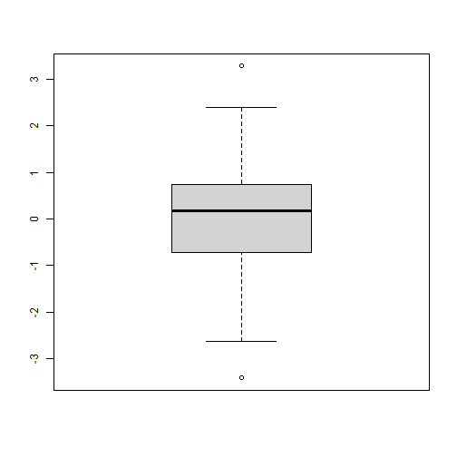
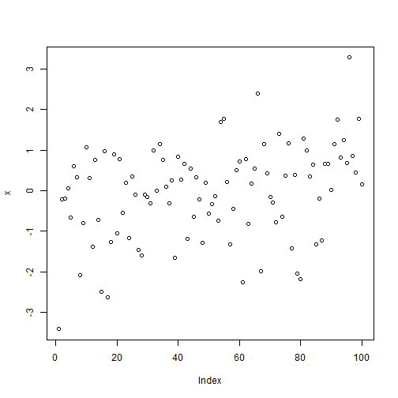
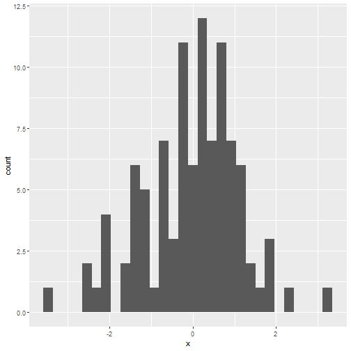
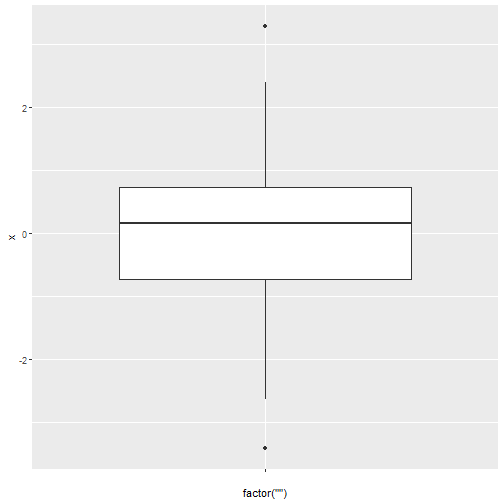
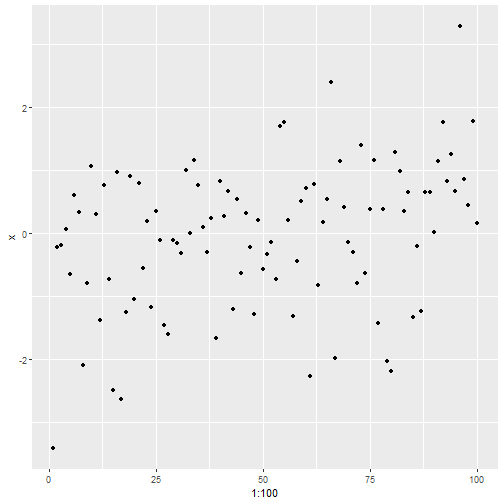
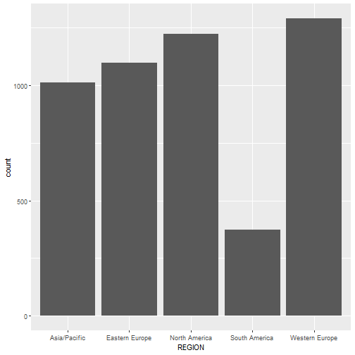
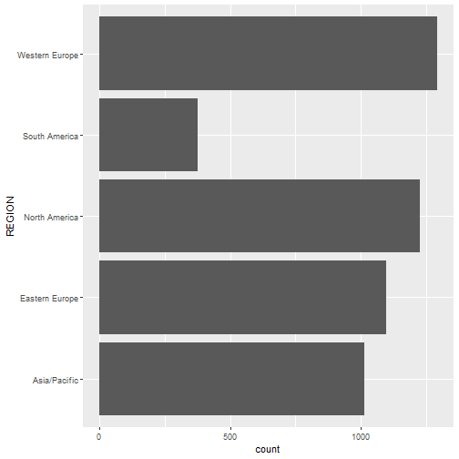
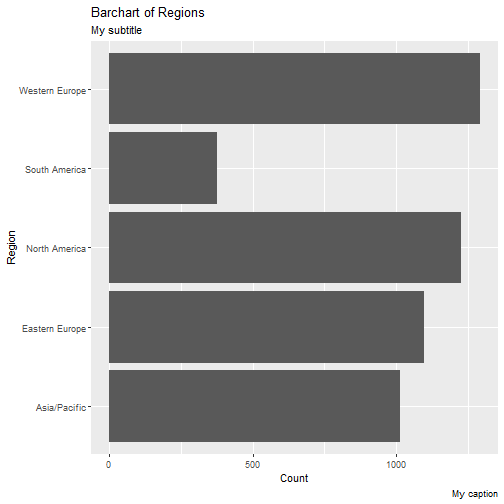
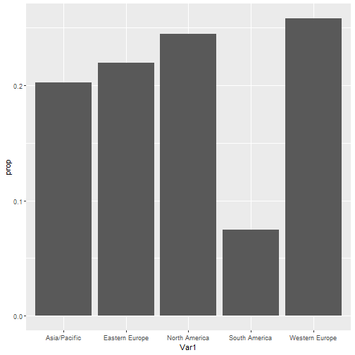
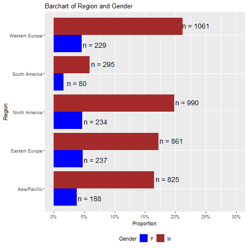

%\VignetteEngine{knitr::knitr}
%\VignetteIndexEntry{Data Manipulation & ggplot2 Training Session}

# Load packages


```r
require(tidyverse)
```

```
## Loading required package: tidyverse
```

```
## ── Attaching packages ─────────────────────────────────────── tidyverse 1.3.2 ──
## ✔ ggplot2 3.3.6     ✔ purrr   0.3.4
## ✔ tibble  3.1.8     ✔ dplyr   1.0.9
## ✔ tidyr   1.2.0     ✔ stringr 1.4.1
## ✔ readr   2.1.2     ✔ forcats 0.5.2
## ── Conflicts ────────────────────────────────────────── tidyverse_conflicts() ──
## ✖ dplyr::arrange()    masks figuRes2::arrange()
## ✖ readr::col_factor() masks figuRes2::col_factor()
## ✖ dplyr::combine()    masks figuRes2::combine()
## ✖ purrr::compact()    masks figuRes2::compact()
## ✖ dplyr::count()      masks figuRes2::count()
## ✖ purrr::discard()    masks figuRes2::discard()
## ✖ dplyr::failwith()   masks figuRes2::failwith()
## ✖ dplyr::filter()     masks stats::filter()
## ✖ dplyr::id()         masks figuRes2::id()
## ✖ dplyr::lag()        masks stats::lag()
## ✖ dplyr::mutate()     masks figuRes2::mutate()
## ✖ dplyr::rename()     masks figuRes2::rename()
## ✖ dplyr::summarise()  masks figuRes2::summarise()
## ✖ dplyr::summarize()  masks figuRes2::summarize()
```

```r
require(gridExtra)
```

```
## Loading required package: gridExtra
## 
## Attaching package: 'gridExtra'
## 
## The following object is masked from 'package:dplyr':
## 
##     combine
```

```r
require(scales)
```

```
## Loading required package: scales
## 
## Attaching package: 'scales'
## 
## The following object is masked from 'package:purrr':
## 
##     discard
## 
## The following object is masked from 'package:readr':
## 
##     col_factor
```

```r
require(figuRes2)
```

# Getting started with graphics with the computer screen in mind

Let's not worry about orienting graphics on a printed page at this point.

## Warm-up with some comparison with Base R:

### Histogram, boxplot, scatterplot in base R

Base R is great for getting a quick view of your data:


```r
x <- rnorm(100)
hist(x)
```


```r
boxplot(x)
```



```r
plot(x)
```



## Histogram, boxplot, scatterplot in ggplot

But ggplot2 offers aesthetic and programming advantages.


```r
my.df <- data.frame(x=x)
ggplot(data=my.df, aes(x=x)) + geom_histogram()
```

```
## `stat_bin()` using `bins = 30`. Pick better value with `binwidth`.
```



```r
ggplot(data=my.df, aes(x=factor(""), y=x)) + geom_boxplot()
```



```r
ggplot(data=my.df, aes(x=1:100, y=x))+geom_point()
```




# Getting aquainted with a dummy demography data set

This is dummy data set we will use to create some graphics.


```r
# dframe=read.csv("demog.csv")
data(demog.data)
```

## Explore data


```r
head(demog.data)
```

```
##       CENTREID SUBJID AGE SEX    TRTGRP         REGION HEIGHT WEIGHT DIABET
## 5699     60016  17380  58   M Treatment   Asia/Pacific    165   65.0      1
## 8622     67458  24040  62   M   Placebo Western Europe    181   88.0      0
## 11716    58401  30384  63   M   Placebo Western Europe    175   77.0      0
## 9633     57867  26373  63   F   Placebo Western Europe    159   81.4      0
## 13562    59286  34327  70   M Treatment Western Europe    160   81.3      1
## 4004     59512  13390  80   M Treatment   Asia/Pacific    151   62.0      0
##       SYSBP DIABP      BMI      BMI.GRP GFR.GRP HDLC
## 5699    116    78 23.87511    <25 kg/m2    Mild 1.04
## 8622    132    79 26.86121 25-<30 kg/m2    Mild 1.14
## 11716   140    81 25.14286 25-<30 kg/m2  Normal 1.83
## 9633    165   101 32.19809   >=30 kg/m2    Mild 1.82
## 13562   132    78 31.75781   >=30 kg/m2    Mild 1.30
## 4004    144    83 27.19179 25-<30 kg/m2    Mild 1.38
```

### Getting aquainted with REGION column

This a column holding info on Region.


```r
table(demog.data$REGION)
```

```
## 
##   Asia/Pacific Eastern Europe  North America  South America Western Europe 
##           1013           1098           1224            375           1290
```

```r
data.frame(table(demog.data$REGION))
```

```
##             Var1 Freq
## 1   Asia/Pacific 1013
## 2 Eastern Europe 1098
## 3  North America 1224
## 4  South America  375
## 5 Western Europe 1290
```

# Bar charts 

## Suppose we want a simple univariate barchart


```r
ggplot(data=demog.data, aes(x=REGION)) + geom_bar()
```



## Swap X and Y Axes with coord_flip


```r
ggplot(data=demog.data, aes(x=REGION)) + geom_bar() + coord_flip()
```



## Assignment of ggplot object to variable


```r
p <- ggplot(data=demog.data, aes(x=REGION)) + geom_bar() + coord_flip()
# print or simply send p to command line
print(p)
```


## Manipulate labels and tick marks

### Add labels


```r
p + labs(title="Barchart of Regions", y = "Count", x="Region", subtitle="My subtitle", caption="My caption")
```



### Manipulate tickmarks

We can control the tick marks using the breaks option. It is good practice to use breaks which extend up to or beyond the planned limits of the graph.


```r
p + scale_y_continuous(breaks=seq(0,6000, 500), limits= c(0, 5000))
```


```r
# Note that tick mark at 5000 is not printed.
p + scale_y_continuous(breaks=seq(0,4500, 500), limits= c(0, 5000))
```


### Altogether now...


```r
p + labs(title="Barchart of Regions", y = "Count", x="Region", subtitle="My subtitle", caption="My caption")+ scale_y_continuous(breaks=seq(0,4000, 500))
```


## Manipulating the orders factor levels are plotted

To exert control over the order of categories, we need to convert REGION from a character vector into a factor vector.


```r
class(demog.data)
```

```
## [1] "data.frame"
```

```r
demog.data$REGION
```

```
##    [1] Asia/Pacific   Western Europe Western Europe Western Europe
##    [5] Western Europe Asia/Pacific   Eastern Europe Asia/Pacific  
##    [9] North America  Asia/Pacific   Western Europe South America 
##   [13] Asia/Pacific   North America  Eastern Europe Western Europe
##   [17] Western Europe Asia/Pacific   Eastern Europe Western Europe
##   [21] North America  North America  Eastern Europe North America 
##   [25] North America  Asia/Pacific   Eastern Europe North America 
##   [29] Asia/Pacific   North America  Western Europe North America 
##   [33] North America  Western Europe Western Europe Western Europe
##   [37] Asia/Pacific   Eastern Europe Eastern Europe Western Europe
##   [41] Western Europe Eastern Europe North America  North America 
##   [45] North America  Western Europe North America  North America 
##   [49] Western Europe Western Europe North America  South America 
##   [53] Eastern Europe Asia/Pacific   Asia/Pacific   Western Europe
##   [57] Western Europe Eastern Europe Asia/Pacific   North America 
##   [61] Asia/Pacific   Western Europe Eastern Europe Eastern Europe
##   [65] Asia/Pacific   Asia/Pacific   North America  North America 
##   [69] Western Europe North America  North America  South America 
##   [73] Western Europe Western Europe Eastern Europe Asia/Pacific  
##   [77] Eastern Europe Eastern Europe Eastern Europe Eastern Europe
##   [81] Eastern Europe Western Europe North America  Western Europe
##   [85] North America  South America  Eastern Europe Eastern Europe
##   [89] North America  Eastern Europe Western Europe South America 
##   [93] South America  Asia/Pacific   Asia/Pacific   North America 
##   [97] Asia/Pacific   North America  Western Europe Western Europe
##  [101] North America  Eastern Europe South America  Western Europe
##  [105] Western Europe Eastern Europe North America  North America 
##  [109] Asia/Pacific   North America  South America  Western Europe
##  [113] Eastern Europe Western Europe Asia/Pacific   Western Europe
##  [117] South America  Eastern Europe Eastern Europe Western Europe
##  [121] South America  Eastern Europe North America  Eastern Europe
##  [125] Western Europe North America  Eastern Europe Western Europe
##  [129] North America  South America  North America  Eastern Europe
##  [133] North America  Eastern Europe South America  Western Europe
##  [137] Eastern Europe North America  Western Europe Asia/Pacific  
##  [141] Western Europe Asia/Pacific   Western Europe Asia/Pacific  
##  [145] North America  North America  Eastern Europe Western Europe
##  [149] Western Europe North America  North America  North America 
##  [153] Asia/Pacific   Western Europe North America  Eastern Europe
##  [157] Asia/Pacific   North America  Asia/Pacific   Eastern Europe
##  [161] North America  Asia/Pacific   Western Europe North America 
##  [165] North America  Asia/Pacific   Western Europe Eastern Europe
##  [169] Western Europe Eastern Europe Asia/Pacific   Western Europe
##  [173] Eastern Europe Western Europe Asia/Pacific   South America 
##  [177] Western Europe Eastern Europe Eastern Europe North America 
##  [181] Asia/Pacific   Western Europe Eastern Europe Asia/Pacific  
##  [185] North America  Eastern Europe North America  Eastern Europe
##  [189] Western Europe South America  Eastern Europe Eastern Europe
##  [193] Western Europe Asia/Pacific   Eastern Europe South America 
##  [197] Western Europe Western Europe Eastern Europe North America 
##  [201] North America  Western Europe North America  Western Europe
##  [205] Western Europe Asia/Pacific   Asia/Pacific   Asia/Pacific  
##  [209] Asia/Pacific   North America  Eastern Europe Eastern Europe
##  [213] North America  South America  Eastern Europe North America 
##  [217] North America  Eastern Europe Asia/Pacific   Eastern Europe
##  [221] Asia/Pacific   Asia/Pacific   South America  North America 
##  [225] North America  Eastern Europe North America  Western Europe
##  [229] Asia/Pacific   Western Europe South America  North America 
##  [233] Western Europe Eastern Europe Western Europe Asia/Pacific  
##  [237] Western Europe Western Europe North America  North America 
##  [241] Western Europe North America  North America  Western Europe
##  [245] Asia/Pacific   North America  North America  Western Europe
##  [249] Eastern Europe Eastern Europe Western Europe Eastern Europe
##  [253] Asia/Pacific   Eastern Europe North America  Asia/Pacific  
##  [257] Western Europe North America  Asia/Pacific   North America 
##  [261] North America  North America  Western Europe Eastern Europe
##  [265] North America  Asia/Pacific   South America  North America 
##  [269] Eastern Europe North America  North America  Western Europe
##  [273] North America  Eastern Europe North America  Eastern Europe
##  [277] Eastern Europe Western Europe Western Europe Asia/Pacific  
##  [281] Asia/Pacific   Western Europe North America  Asia/Pacific  
##  [285] North America  Western Europe Eastern Europe Western Europe
##  [289] Western Europe North America  Western Europe Eastern Europe
##  [293] Eastern Europe Asia/Pacific   Western Europe Eastern Europe
##  [297] Western Europe Asia/Pacific   Eastern Europe Western Europe
##  [301] Western Europe Eastern Europe Asia/Pacific   Asia/Pacific  
##  [305] Asia/Pacific   Eastern Europe Eastern Europe Western Europe
##  [309] Western Europe Eastern Europe North America  Eastern Europe
##  [313] Western Europe Western Europe North America  North America 
##  [317] North America  North America  Asia/Pacific   Western Europe
##  [321] Eastern Europe Eastern Europe Eastern Europe Asia/Pacific  
##  [325] Asia/Pacific   Asia/Pacific   North America  Western Europe
##  [329] Eastern Europe North America  Eastern Europe Asia/Pacific  
##  [333] North America  South America  Eastern Europe Eastern Europe
##  [337] North America  Asia/Pacific   Western Europe Western Europe
##  [341] Western Europe Eastern Europe Western Europe Asia/Pacific  
##  [345] North America  Eastern Europe Asia/Pacific   Eastern Europe
##  [349] Western Europe Asia/Pacific   Western Europe Asia/Pacific  
##  [353] North America  Asia/Pacific   Asia/Pacific   South America 
##  [357] North America  Eastern Europe Asia/Pacific   Asia/Pacific  
##  [361] Western Europe Eastern Europe Asia/Pacific   Eastern Europe
##  [365] North America  Eastern Europe South America  North America 
##  [369] North America  North America  Western Europe Eastern Europe
##  [373] North America  Asia/Pacific   Western Europe Asia/Pacific  
##  [377] Western Europe North America  Western Europe Asia/Pacific  
##  [381] Western Europe Asia/Pacific   South America  Asia/Pacific  
##  [385] Eastern Europe South America  Eastern Europe Asia/Pacific  
##  [389] Eastern Europe Asia/Pacific   Asia/Pacific   North America 
##  [393] Eastern Europe Eastern Europe Eastern Europe Western Europe
##  [397] Eastern Europe Western Europe Asia/Pacific   Asia/Pacific  
##  [401] Eastern Europe Western Europe Western Europe Western Europe
##  [405] Eastern Europe North America  Asia/Pacific   South America 
##  [409] Western Europe Western Europe Asia/Pacific   Asia/Pacific  
##  [413] Eastern Europe Western Europe Western Europe North America 
##  [417] Asia/Pacific   Western Europe Eastern Europe Western Europe
##  [421] Asia/Pacific   Eastern Europe Western Europe Eastern Europe
##  [425] Eastern Europe South America  Eastern Europe North America 
##  [429] North America  Asia/Pacific   Asia/Pacific   Western Europe
##  [433] Western Europe Western Europe North America  Eastern Europe
##  [437] North America  North America  Eastern Europe Eastern Europe
##  [441] Western Europe Western Europe Eastern Europe Western Europe
##  [445] Asia/Pacific   Asia/Pacific   Eastern Europe North America 
##  [449] Eastern Europe North America  Western Europe Asia/Pacific  
##  [453] North America  North America  North America  Eastern Europe
##  [457] Eastern Europe North America  North America  Western Europe
##  [461] North America  North America  Eastern Europe Western Europe
##  [465] North America  Asia/Pacific   South America  Western Europe
##  [469] Asia/Pacific   Asia/Pacific   South America  Asia/Pacific  
##  [473] Eastern Europe Asia/Pacific   North America  Eastern Europe
##  [477] Western Europe Western Europe Asia/Pacific   North America 
##  [481] Western Europe North America  Western Europe North America 
##  [485] North America  Asia/Pacific   Eastern Europe Eastern Europe
##  [489] Western Europe South America  Western Europe Eastern Europe
##  [493] Western Europe North America  North America  North America 
##  [497] Western Europe Western Europe North America  North America 
##  [501] Eastern Europe Asia/Pacific   Western Europe Western Europe
##  [505] North America  Eastern Europe Asia/Pacific   Eastern Europe
##  [509] North America  Western Europe Eastern Europe Eastern Europe
##  [513] Western Europe North America  Asia/Pacific   Asia/Pacific  
##  [517] Eastern Europe Western Europe South America  North America 
##  [521] Western Europe Western Europe Western Europe South America 
##  [525] North America  Western Europe Western Europe Eastern Europe
##  [529] North America  Western Europe Asia/Pacific   Eastern Europe
##  [533] Western Europe South America  Western Europe North America 
##  [537] Western Europe Eastern Europe Western Europe North America 
##  [541] Eastern Europe Asia/Pacific   Eastern Europe Western Europe
##  [545] North America  Asia/Pacific   Eastern Europe North America 
##  [549] South America  Western Europe Western Europe Asia/Pacific  
##  [553] North America  Asia/Pacific   Eastern Europe Asia/Pacific  
##  [557] Western Europe Asia/Pacific   Eastern Europe North America 
##  [561] Eastern Europe Eastern Europe North America  North America 
##  [565] Western Europe North America  Asia/Pacific   Western Europe
##  [569] Eastern Europe South America  Western Europe Western Europe
##  [573] Asia/Pacific   North America  Eastern Europe South America 
##  [577] North America  South America  Eastern Europe Western Europe
##  [581] Western Europe North America  Asia/Pacific   North America 
##  [585] South America  North America  North America  South America 
##  [589] Eastern Europe North America  South America  Western Europe
##  [593] Western Europe Western Europe South America  Eastern Europe
##  [597] North America  North America  Eastern Europe North America 
##  [601] North America  North America  Western Europe South America 
##  [605] Western Europe Eastern Europe Eastern Europe North America 
##  [609] North America  South America  Eastern Europe Eastern Europe
##  [613] Eastern Europe North America  Eastern Europe Western Europe
##  [617] Asia/Pacific   Western Europe Eastern Europe Eastern Europe
##  [621] Western Europe North America  North America  Asia/Pacific  
##  [625] Asia/Pacific   Eastern Europe Asia/Pacific   Western Europe
##  [629] Western Europe South America  Eastern Europe Asia/Pacific  
##  [633] South America  Western Europe North America  North America 
##  [637] Eastern Europe North America  North America  North America 
##  [641] Western Europe Asia/Pacific   Asia/Pacific   Eastern Europe
##  [645] Western Europe Asia/Pacific   Western Europe Eastern Europe
##  [649] Western Europe Eastern Europe Eastern Europe Eastern Europe
##  [653] Eastern Europe Western Europe Eastern Europe North America 
##  [657] North America  Asia/Pacific   North America  Asia/Pacific  
##  [661] Western Europe Asia/Pacific   Western Europe Eastern Europe
##  [665] Western Europe Western Europe Eastern Europe Eastern Europe
##  [669] North America  Eastern Europe Asia/Pacific   South America 
##  [673] Asia/Pacific   Eastern Europe Western Europe North America 
##  [677] North America  Asia/Pacific   North America  Asia/Pacific  
##  [681] North America  Western Europe North America  Western Europe
##  [685] North America  Western Europe Asia/Pacific   Eastern Europe
##  [689] North America  Eastern Europe Western Europe North America 
##  [693] Asia/Pacific   Eastern Europe Western Europe Asia/Pacific  
##  [697] Asia/Pacific   Western Europe North America  Eastern Europe
##  [701] Asia/Pacific   South America  Western Europe South America 
##  [705] Asia/Pacific   Asia/Pacific   North America  Western Europe
##  [709] North America  Western Europe South America  Asia/Pacific  
##  [713] Asia/Pacific   Western Europe Eastern Europe Western Europe
##  [717] Asia/Pacific   North America  South America  Western Europe
##  [721] North America  North America  Asia/Pacific   Western Europe
##  [725] Eastern Europe South America  North America  Asia/Pacific  
##  [729] Western Europe Western Europe Eastern Europe Eastern Europe
##  [733] Asia/Pacific   South America  Asia/Pacific   Asia/Pacific  
##  [737] Eastern Europe North America  Eastern Europe Eastern Europe
##  [741] Eastern Europe Asia/Pacific   Eastern Europe Western Europe
##  [745] North America  Western Europe Western Europe North America 
##  [749] Eastern Europe Eastern Europe Eastern Europe Eastern Europe
##  [753] North America  Asia/Pacific   Western Europe Western Europe
##  [757] Western Europe Eastern Europe North America  North America 
##  [761] North America  Western Europe Asia/Pacific   Western Europe
##  [765] North America  North America  Asia/Pacific   North America 
##  [769] North America  Asia/Pacific   Asia/Pacific   Western Europe
##  [773] North America  North America  Western Europe Asia/Pacific  
##  [777] Western Europe North America  Eastern Europe Western Europe
##  [781] North America  Eastern Europe Western Europe Asia/Pacific  
##  [785] Western Europe Western Europe North America  Western Europe
##  [789] North America  North America  Asia/Pacific   Western Europe
##  [793] Asia/Pacific   South America  North America  North America 
##  [797] Asia/Pacific   Asia/Pacific   North America  Asia/Pacific  
##  [801] South America  Western Europe North America  Eastern Europe
##  [805] Asia/Pacific   Western Europe Asia/Pacific   Eastern Europe
##  [809] North America  Western Europe North America  Asia/Pacific  
##  [813] Eastern Europe South America  Eastern Europe Western Europe
##  [817] North America  Western Europe North America  North America 
##  [821] Western Europe North America  Asia/Pacific   Eastern Europe
##  [825] Western Europe Eastern Europe Asia/Pacific   North America 
##  [829] Western Europe Eastern Europe North America  Eastern Europe
##  [833] Asia/Pacific   Asia/Pacific   Eastern Europe Eastern Europe
##  [837] Asia/Pacific   Eastern Europe North America  Eastern Europe
##  [841] North America  North America  North America  Western Europe
##  [845] Western Europe Asia/Pacific   Eastern Europe Asia/Pacific  
##  [849] Western Europe Eastern Europe Eastern Europe Western Europe
##  [853] Western Europe Western Europe Eastern Europe Western Europe
##  [857] Asia/Pacific   Western Europe Eastern Europe North America 
##  [861] North America  Asia/Pacific   North America  Asia/Pacific  
##  [865] North America  Eastern Europe Asia/Pacific   Asia/Pacific  
##  [869] Eastern Europe North America  Asia/Pacific   Western Europe
##  [873] North America  Eastern Europe Eastern Europe Asia/Pacific  
##  [877] Western Europe Eastern Europe Asia/Pacific   Asia/Pacific  
##  [881] Eastern Europe Eastern Europe North America  North America 
##  [885] Eastern Europe Eastern Europe North America  Eastern Europe
##  [889] Asia/Pacific   Asia/Pacific   Western Europe Asia/Pacific  
##  [893] Asia/Pacific   Western Europe North America  North America 
##  [897] Western Europe Western Europe Western Europe North America 
##  [901] Eastern Europe Western Europe Eastern Europe South America 
##  [905] Asia/Pacific   Western Europe South America  Western Europe
##  [909] Asia/Pacific   Asia/Pacific   North America  Asia/Pacific  
##  [913] Eastern Europe Eastern Europe North America  Western Europe
##  [917] Western Europe Asia/Pacific   North America  Asia/Pacific  
##  [921] Western Europe Asia/Pacific   North America  North America 
##  [925] Asia/Pacific   Asia/Pacific   Asia/Pacific   Asia/Pacific  
##  [929] Western Europe Asia/Pacific   Asia/Pacific   Western Europe
##  [933] Eastern Europe Eastern Europe North America  South America 
##  [937] Eastern Europe North America  Eastern Europe Eastern Europe
##  [941] Western Europe Asia/Pacific   Western Europe Western Europe
##  [945] Asia/Pacific   Eastern Europe Asia/Pacific   Asia/Pacific  
##  [949] Western Europe Asia/Pacific   Western Europe Eastern Europe
##  [953] Asia/Pacific   Asia/Pacific   North America  Western Europe
##  [957] Western Europe Asia/Pacific   Asia/Pacific   Western Europe
##  [961] Eastern Europe Western Europe Western Europe Asia/Pacific  
##  [965] Western Europe North America  North America  Western Europe
##  [969] North America  South America  South America  Western Europe
##  [973] Eastern Europe Asia/Pacific   Eastern Europe Asia/Pacific  
##  [977] Asia/Pacific   North America  Asia/Pacific   Eastern Europe
##  [981] Asia/Pacific   Western Europe Western Europe North America 
##  [985] Western Europe North America  Western Europe Eastern Europe
##  [989] Eastern Europe North America  Asia/Pacific   Western Europe
##  [993] North America  Eastern Europe Eastern Europe North America 
##  [997] South America  Eastern Europe Western Europe Western Europe
## [1001] Western Europe Eastern Europe South America  Eastern Europe
## [1005] North America  Eastern Europe Eastern Europe Asia/Pacific  
## [1009] Asia/Pacific   Western Europe North America  Western Europe
## [1013] Western Europe Asia/Pacific   Western Europe Asia/Pacific  
## [1017] North America  North America  Western Europe North America 
## [1021] Western Europe Western Europe North America  Asia/Pacific  
## [1025] Western Europe Eastern Europe Asia/Pacific   North America 
## [1029] Asia/Pacific   Asia/Pacific   North America  North America 
## [1033] North America  North America  Asia/Pacific   North America 
## [1037] Western Europe North America  Western Europe Asia/Pacific  
## [1041] Western Europe South America  North America  Western Europe
## [1045] Western Europe Western Europe Western Europe Eastern Europe
## [1049] North America  Western Europe Asia/Pacific   North America 
## [1053] Eastern Europe Western Europe Western Europe Western Europe
## [1057] Western Europe Asia/Pacific   Asia/Pacific   Eastern Europe
## [1061] Western Europe Eastern Europe South America  Western Europe
## [1065] North America  South America  Asia/Pacific   Eastern Europe
## [1069] South America  North America  North America  North America 
## [1073] Eastern Europe Asia/Pacific   Asia/Pacific   North America 
## [1077] North America  Western Europe Asia/Pacific   South America 
## [1081] North America  Asia/Pacific   South America  Eastern Europe
## [1085] Asia/Pacific   Western Europe Western Europe Asia/Pacific  
## [1089] Eastern Europe Eastern Europe Eastern Europe Eastern Europe
## [1093] North America  Asia/Pacific   North America  Western Europe
## [1097] Asia/Pacific   Eastern Europe Asia/Pacific   Eastern Europe
## [1101] Asia/Pacific   Western Europe South America  Asia/Pacific  
## [1105] North America  Asia/Pacific   Western Europe North America 
## [1109] Eastern Europe Western Europe Eastern Europe Western Europe
## [1113] South America  Eastern Europe North America  North America 
## [1117] Eastern Europe North America  North America  Eastern Europe
## [1121] Western Europe South America  Eastern Europe Asia/Pacific  
## [1125] Western Europe Eastern Europe Western Europe North America 
## [1129] North America  Eastern Europe South America  Asia/Pacific  
## [1133] Western Europe Western Europe Western Europe Eastern Europe
## [1137] Western Europe Asia/Pacific   North America  Eastern Europe
## [1141] North America  Western Europe North America  Eastern Europe
## [1145] North America  North America  Asia/Pacific   North America 
## [1149] Asia/Pacific   Asia/Pacific   North America  Eastern Europe
## [1153] Asia/Pacific   Western Europe North America  North America 
## [1157] Asia/Pacific   Asia/Pacific   Eastern Europe North America 
## [1161] Eastern Europe Western Europe Asia/Pacific   Western Europe
## [1165] Western Europe Eastern Europe Asia/Pacific   Western Europe
## [1169] Asia/Pacific   North America  Western Europe South America 
## [1173] North America  South America  Western Europe Asia/Pacific  
## [1177] South America  Western Europe North America  Asia/Pacific  
## [1181] North America  North America  North America  Western Europe
## [1185] Western Europe Asia/Pacific   Western Europe Western Europe
## [1189] South America  Asia/Pacific   Asia/Pacific   Western Europe
## [1193] North America  Eastern Europe Eastern Europe Western Europe
## [1197] Eastern Europe Eastern Europe North America  Eastern Europe
## [1201] North America  Asia/Pacific   South America  North America 
## [1205] North America  North America  Asia/Pacific   Western Europe
## [1209] Asia/Pacific   South America  Asia/Pacific   Eastern Europe
## [1213] Western Europe North America  Eastern Europe Eastern Europe
## [1217] Western Europe North America  North America  Asia/Pacific  
## [1221] Western Europe Asia/Pacific   Asia/Pacific   Eastern Europe
## [1225] Western Europe North America  North America  North America 
## [1229] Western Europe Western Europe South America  Eastern Europe
## [1233] Eastern Europe Western Europe Eastern Europe Asia/Pacific  
## [1237] North America  Asia/Pacific   North America  Western Europe
## [1241] Western Europe Western Europe Eastern Europe South America 
## [1245] Asia/Pacific   Asia/Pacific   Western Europe Western Europe
## [1249] Western Europe North America  Eastern Europe North America 
## [1253] Western Europe Asia/Pacific   Western Europe Eastern Europe
## [1257] South America  Asia/Pacific   Asia/Pacific   North America 
## [1261] Asia/Pacific   Eastern Europe North America  Western Europe
## [1265] Western Europe South America  South America  Eastern Europe
## [1269] Asia/Pacific   Asia/Pacific   Western Europe North America 
## [1273] Western Europe Western Europe Western Europe Western Europe
## [1277] North America  South America  Eastern Europe Western Europe
## [1281] Western Europe Western Europe South America  North America 
## [1285] Western Europe Western Europe Asia/Pacific   North America 
## [1289] Eastern Europe North America  Asia/Pacific   North America 
## [1293] Eastern Europe Western Europe Asia/Pacific   North America 
## [1297] Asia/Pacific   North America  Western Europe Western Europe
## [1301] Asia/Pacific   Asia/Pacific   Asia/Pacific   North America 
## [1305] Eastern Europe Eastern Europe North America  North America 
## [1309] North America  Western Europe North America  Western Europe
## [1313] North America  Western Europe Western Europe Asia/Pacific  
## [1317] North America  Asia/Pacific   North America  South America 
## [1321] Asia/Pacific   Asia/Pacific   North America  North America 
## [1325] Western Europe Asia/Pacific   Asia/Pacific   Eastern Europe
## [1329] Asia/Pacific   South America  Western Europe Western Europe
## [1333] Western Europe Eastern Europe Western Europe Asia/Pacific  
## [1337] Asia/Pacific   North America  Western Europe North America 
## [1341] Western Europe North America  Eastern Europe Western Europe
## [1345] Western Europe Western Europe Eastern Europe Asia/Pacific  
## [1349] Eastern Europe Western Europe Eastern Europe Asia/Pacific  
## [1353] Eastern Europe South America  Western Europe North America 
## [1357] Eastern Europe South America  Asia/Pacific   North America 
## [1361] North America  Eastern Europe North America  Eastern Europe
## [1365] Western Europe Eastern Europe Western Europe Eastern Europe
## [1369] Western Europe Western Europe North America  Asia/Pacific  
## [1373] North America  North America  Western Europe Eastern Europe
## [1377] Eastern Europe Eastern Europe Western Europe North America 
## [1381] North America  Western Europe South America  Eastern Europe
## [1385] South America  Western Europe Eastern Europe Eastern Europe
## [1389] North America  Western Europe North America  Asia/Pacific  
## [1393] Western Europe North America  Eastern Europe Eastern Europe
## [1397] North America  North America  Asia/Pacific   Asia/Pacific  
## [1401] Western Europe Eastern Europe Eastern Europe Western Europe
## [1405] Asia/Pacific   Western Europe Western Europe Asia/Pacific  
## [1409] Eastern Europe Western Europe North America  North America 
## [1413] Western Europe Western Europe Western Europe Western Europe
## [1417] Eastern Europe North America  Western Europe Western Europe
## [1421] Western Europe Asia/Pacific   South America  Eastern Europe
## [1425] Eastern Europe Western Europe North America  Asia/Pacific  
## [1429] Asia/Pacific   North America  Eastern Europe Asia/Pacific  
## [1433] Eastern Europe Eastern Europe North America  Western Europe
## [1437] Western Europe Asia/Pacific   Asia/Pacific   Eastern Europe
## [1441] Western Europe North America  North America  Western Europe
## [1445] Eastern Europe Western Europe Asia/Pacific   Eastern Europe
## [1449] Asia/Pacific   North America  North America  Eastern Europe
## [1453] Asia/Pacific   Eastern Europe South America  Asia/Pacific  
## [1457] Eastern Europe Asia/Pacific   South America  Western Europe
## [1461] Western Europe North America  Eastern Europe Western Europe
## [1465] Eastern Europe North America  North America  Western Europe
## [1469] Western Europe Western Europe Western Europe North America 
## [1473] Eastern Europe Eastern Europe North America  North America 
## [1477] Western Europe Asia/Pacific   Western Europe Eastern Europe
## [1481] Eastern Europe Asia/Pacific   Eastern Europe Asia/Pacific  
## [1485] South America  South America  Eastern Europe South America 
## [1489] North America  North America  North America  North America 
## [1493] South America  Western Europe Eastern Europe Western Europe
## [1497] Asia/Pacific   Western Europe North America  Asia/Pacific  
## [1501] North America  Western Europe Western Europe Western Europe
## [1505] Western Europe South America  Eastern Europe Western Europe
## [1509] Western Europe Western Europe Asia/Pacific   Western Europe
## [1513] Eastern Europe Western Europe Eastern Europe North America 
## [1517] Western Europe Asia/Pacific   Eastern Europe Western Europe
## [1521] Asia/Pacific   Asia/Pacific   Eastern Europe Western Europe
## [1525] Asia/Pacific   South America  Western Europe Asia/Pacific  
## [1529] Eastern Europe Eastern Europe Western Europe Western Europe
## [1533] Asia/Pacific   Asia/Pacific   Eastern Europe Eastern Europe
## [1537] North America  Western Europe North America  Asia/Pacific  
## [1541] Eastern Europe Western Europe Eastern Europe Asia/Pacific  
## [1545] North America  Western Europe Western Europe Western Europe
## [1549] South America  North America  Eastern Europe Western Europe
## [1553] Asia/Pacific   North America  Eastern Europe Western Europe
## [1557] Asia/Pacific   North America  North America  South America 
## [1561] North America  Western Europe Asia/Pacific   Western Europe
## [1565] Asia/Pacific   Western Europe South America  Asia/Pacific  
## [1569] Eastern Europe Asia/Pacific   Western Europe Western Europe
## [1573] Western Europe Western Europe Western Europe North America 
## [1577] Eastern Europe North America  Eastern Europe Western Europe
## [1581] North America  North America  North America  North America 
## [1585] Eastern Europe Western Europe Asia/Pacific   Eastern Europe
## [1589] Asia/Pacific   Asia/Pacific   North America  Eastern Europe
## [1593] Western Europe North America  Western Europe North America 
## [1597] South America  Asia/Pacific   Western Europe Asia/Pacific  
## [1601] Western Europe North America  Western Europe Asia/Pacific  
## [1605] Western Europe Asia/Pacific   Western Europe North America 
## [1609] Eastern Europe Western Europe North America  Asia/Pacific  
## [1613] Western Europe South America  North America  North America 
## [1617] Eastern Europe North America  North America  South America 
## [1621] North America  North America  South America  Western Europe
## [1625] Western Europe North America  Eastern Europe Western Europe
## [1629] Western Europe North America  Eastern Europe North America 
## [1633] Asia/Pacific   North America  Eastern Europe North America 
## [1637] Western Europe Eastern Europe South America  Asia/Pacific  
## [1641] Western Europe North America  North America  North America 
## [1645] North America  North America  Western Europe South America 
## [1649] Western Europe Asia/Pacific   North America  Eastern Europe
## [1653] Eastern Europe Western Europe Asia/Pacific   North America 
## [1657] North America  North America  Eastern Europe Eastern Europe
## [1661] Asia/Pacific   Western Europe Asia/Pacific   North America 
## [1665] Eastern Europe North America  Asia/Pacific   North America 
## [1669] Eastern Europe Western Europe Asia/Pacific   Asia/Pacific  
## [1673] Western Europe North America  Eastern Europe Asia/Pacific  
## [1677] Asia/Pacific   Eastern Europe Eastern Europe South America 
## [1681] Eastern Europe Eastern Europe Asia/Pacific   Eastern Europe
## [1685] North America  Asia/Pacific   North America  North America 
## [1689] Western Europe Asia/Pacific   Western Europe Asia/Pacific  
## [1693] Eastern Europe Asia/Pacific   North America  Asia/Pacific  
## [1697] Eastern Europe Asia/Pacific   Western Europe Asia/Pacific  
## [1701] Asia/Pacific   Western Europe Asia/Pacific   Eastern Europe
## [1705] North America  Eastern Europe North America  Western Europe
## [1709] Asia/Pacific   North America  North America  Asia/Pacific  
## [1713] North America  Western Europe North America  North America 
## [1717] South America  Western Europe Western Europe North America 
## [1721] Western Europe North America  North America  North America 
## [1725] Eastern Europe North America  South America  North America 
## [1729] Western Europe Asia/Pacific   Western Europe Eastern Europe
## [1733] South America  North America  Western Europe Eastern Europe
## [1737] North America  Asia/Pacific   Western Europe Eastern Europe
## [1741] Western Europe North America  North America  Eastern Europe
## [1745] Western Europe South America  Asia/Pacific   North America 
## [1749] Eastern Europe Eastern Europe Asia/Pacific   Western Europe
## [1753] Asia/Pacific   Eastern Europe Asia/Pacific   Asia/Pacific  
## [1757] Western Europe Western Europe Asia/Pacific   Asia/Pacific  
## [1761] Eastern Europe Eastern Europe Eastern Europe Asia/Pacific  
## [1765] Asia/Pacific   Western Europe North America  Western Europe
## [1769] Western Europe Western Europe Eastern Europe Asia/Pacific  
## [1773] Western Europe Western Europe North America  Eastern Europe
## [1777] North America  Asia/Pacific   South America  Asia/Pacific  
## [1781] North America  North America  North America  Western Europe
## [1785] Asia/Pacific   Eastern Europe Eastern Europe North America 
## [1789] North America  Western Europe Eastern Europe Asia/Pacific  
## [1793] Western Europe Western Europe South America  North America 
## [1797] Western Europe North America  North America  South America 
## [1801] Eastern Europe Eastern Europe North America  Western Europe
## [1805] Eastern Europe South America  Eastern Europe Eastern Europe
## [1809] Western Europe North America  Western Europe Western Europe
## [1813] Western Europe Asia/Pacific   Asia/Pacific   Asia/Pacific  
## [1817] Western Europe Asia/Pacific   North America  Eastern Europe
## [1821] Western Europe North America  North America  Asia/Pacific  
## [1825] Western Europe South America  Eastern Europe South America 
## [1829] North America  North America  Asia/Pacific   North America 
## [1833] Western Europe Asia/Pacific   Asia/Pacific   South America 
## [1837] Eastern Europe Asia/Pacific   Eastern Europe North America 
## [1841] South America  Western Europe North America  South America 
## [1845] North America  Western Europe Western Europe North America 
## [1849] Eastern Europe South America  Asia/Pacific   Western Europe
## [1853] Asia/Pacific   North America  North America  Eastern Europe
## [1857] Western Europe Eastern Europe Asia/Pacific   Western Europe
## [1861] Asia/Pacific   Eastern Europe Eastern Europe Eastern Europe
## [1865] Asia/Pacific   Western Europe North America  Eastern Europe
## [1869] Western Europe South America  Western Europe South America 
## [1873] Western Europe Eastern Europe Eastern Europe Eastern Europe
## [1877] Eastern Europe Asia/Pacific   Western Europe Western Europe
## [1881] Western Europe South America  Eastern Europe Eastern Europe
## [1885] North America  North America  Eastern Europe Western Europe
## [1889] Asia/Pacific   North America  Western Europe North America 
## [1893] North America  North America  North America  North America 
## [1897] Asia/Pacific   North America  Eastern Europe Eastern Europe
## [1901] Asia/Pacific   North America  Eastern Europe Asia/Pacific  
## [1905] Eastern Europe North America  Asia/Pacific   Asia/Pacific  
## [1909] North America  Western Europe Western Europe Eastern Europe
## [1913] Asia/Pacific   Asia/Pacific   Western Europe Western Europe
## [1917] North America  South America  North America  Eastern Europe
## [1921] Western Europe Western Europe North America  Asia/Pacific  
## [1925] South America  Asia/Pacific   North America  South America 
## [1929] North America  Asia/Pacific   Eastern Europe Eastern Europe
## [1933] Asia/Pacific   Western Europe South America  Asia/Pacific  
## [1937] Western Europe South America  Western Europe Western Europe
## [1941] Western Europe Eastern Europe Eastern Europe South America 
## [1945] North America  South America  Western Europe Asia/Pacific  
## [1949] Western Europe Eastern Europe Eastern Europe Asia/Pacific  
## [1953] Western Europe Asia/Pacific   Asia/Pacific   North America 
## [1957] Western Europe Western Europe North America  Asia/Pacific  
## [1961] South America  North America  Asia/Pacific   North America 
## [1965] Western Europe South America  Western Europe Eastern Europe
## [1969] Eastern Europe Asia/Pacific   Eastern Europe Western Europe
## [1973] Asia/Pacific   North America  North America  Asia/Pacific  
## [1977] Western Europe Eastern Europe Asia/Pacific   North America 
## [1981] Western Europe Eastern Europe Eastern Europe Western Europe
## [1985] Western Europe Western Europe Eastern Europe Eastern Europe
## [1989] North America  Asia/Pacific   North America  South America 
## [1993] Western Europe North America  North America  Eastern Europe
## [1997] Western Europe Asia/Pacific   Eastern Europe North America 
## [2001] North America  Western Europe North America  Western Europe
## [2005] Eastern Europe Eastern Europe Eastern Europe Eastern Europe
## [2009] Western Europe Western Europe Western Europe Eastern Europe
## [2013] Eastern Europe North America  Western Europe Eastern Europe
## [2017] North America  Eastern Europe South America  Eastern Europe
## [2021] Western Europe Eastern Europe South America  Western Europe
## [2025] North America  Eastern Europe Eastern Europe North America 
## [2029] North America  North America  Asia/Pacific   Eastern Europe
## [2033] Western Europe Western Europe North America  North America 
## [2037] North America  South America  Western Europe Eastern Europe
## [2041] Eastern Europe Eastern Europe Western Europe North America 
## [2045] South America  Western Europe Asia/Pacific   South America 
## [2049] Eastern Europe Asia/Pacific   North America  North America 
## [2053] Eastern Europe Eastern Europe North America  Western Europe
## [2057] South America  Asia/Pacific   Western Europe Asia/Pacific  
## [2061] Asia/Pacific   Eastern Europe Eastern Europe Asia/Pacific  
## [2065] Eastern Europe Asia/Pacific   North America  North America 
## [2069] Eastern Europe Eastern Europe Western Europe Asia/Pacific  
## [2073] Western Europe North America  North America  Western Europe
## [2077] North America  North America  Western Europe Western Europe
## [2081] Asia/Pacific   South America  North America  Western Europe
## [2085] Asia/Pacific   South America  North America  Eastern Europe
## [2089] North America  Western Europe Asia/Pacific   Eastern Europe
## [2093] Asia/Pacific   South America  Eastern Europe Western Europe
## [2097] North America  Eastern Europe North America  North America 
## [2101] North America  Asia/Pacific   Asia/Pacific   Eastern Europe
## [2105] Eastern Europe Eastern Europe Asia/Pacific   Asia/Pacific  
## [2109] Eastern Europe North America  Eastern Europe Asia/Pacific  
## [2113] North America  Asia/Pacific   Western Europe Asia/Pacific  
## [2117] North America  South America  Eastern Europe Asia/Pacific  
## [2121] Western Europe Western Europe North America  Western Europe
## [2125] Eastern Europe North America  Western Europe South America 
## [2129] Asia/Pacific   North America  Eastern Europe Western Europe
## [2133] North America  Western Europe Western Europe Asia/Pacific  
## [2137] North America  Western Europe North America  North America 
## [2141] Western Europe Eastern Europe Western Europe North America 
## [2145] Asia/Pacific   North America  Western Europe Asia/Pacific  
## [2149] North America  North America  Eastern Europe Western Europe
## [2153] North America  Western Europe Asia/Pacific   Eastern Europe
## [2157] Eastern Europe Western Europe Western Europe Western Europe
## [2161] Eastern Europe Western Europe North America  North America 
## [2165] Western Europe Eastern Europe Western Europe Eastern Europe
## [2169] Asia/Pacific   North America  South America  Western Europe
## [2173] Western Europe Asia/Pacific   Western Europe Eastern Europe
## [2177] Eastern Europe Eastern Europe Asia/Pacific   Asia/Pacific  
## [2181] Asia/Pacific   Eastern Europe Asia/Pacific   Western Europe
## [2185] Western Europe Western Europe Asia/Pacific   South America 
## [2189] Western Europe Eastern Europe Western Europe Eastern Europe
## [2193] North America  Western Europe Eastern Europe Eastern Europe
## [2197] Asia/Pacific   South America  Western Europe Western Europe
## [2201] Asia/Pacific   Eastern Europe Asia/Pacific   North America 
## [2205] South America  North America  Asia/Pacific   Asia/Pacific  
## [2209] North America  North America  Western Europe Western Europe
## [2213] Western Europe North America  Western Europe Western Europe
## [2217] North America  Asia/Pacific   Eastern Europe Western Europe
## [2221] Eastern Europe Eastern Europe Eastern Europe Western Europe
## [2225] Western Europe North America  Asia/Pacific   Asia/Pacific  
## [2229] South America  Western Europe North America  Eastern Europe
## [2233] Asia/Pacific   North America  North America  North America 
## [2237] North America  Western Europe Western Europe South America 
## [2241] Western Europe Western Europe North America  Eastern Europe
## [2245] Eastern Europe Western Europe North America  North America 
## [2249] Western Europe Asia/Pacific   North America  Western Europe
## [2253] Eastern Europe Eastern Europe Western Europe Western Europe
## [2257] Asia/Pacific   North America  Eastern Europe Eastern Europe
## [2261] Western Europe North America  Eastern Europe Asia/Pacific  
## [2265] Eastern Europe Eastern Europe North America  South America 
## [2269] North America  Asia/Pacific   North America  South America 
## [2273] Western Europe Western Europe North America  Asia/Pacific  
## [2277] North America  Western Europe Western Europe Asia/Pacific  
## [2281] South America  Asia/Pacific   North America  Asia/Pacific  
## [2285] Asia/Pacific   Asia/Pacific   Eastern Europe Asia/Pacific  
## [2289] Western Europe Western Europe South America  Asia/Pacific  
## [2293] Eastern Europe Eastern Europe Western Europe North America 
## [2297] Eastern Europe Eastern Europe Asia/Pacific   Western Europe
## [2301] Western Europe Western Europe North America  Western Europe
## [2305] South America  Western Europe Asia/Pacific   Asia/Pacific  
## [2309] Western Europe North America  Western Europe North America 
## [2313] North America  Asia/Pacific   Western Europe North America 
## [2317] Western Europe Eastern Europe South America  Western Europe
## [2321] North America  Eastern Europe Asia/Pacific   Asia/Pacific  
## [2325] Eastern Europe Asia/Pacific   Asia/Pacific   North America 
## [2329] North America  Eastern Europe Asia/Pacific   Western Europe
## [2333] Eastern Europe North America  Eastern Europe North America 
## [2337] Asia/Pacific   Western Europe North America  North America 
## [2341] Western Europe Western Europe Eastern Europe Western Europe
## [2345] Western Europe Western Europe Western Europe North America 
## [2349] Asia/Pacific   Asia/Pacific   Western Europe Asia/Pacific  
## [2353] Eastern Europe Asia/Pacific   Asia/Pacific   Western Europe
## [2357] Asia/Pacific   Asia/Pacific   Western Europe Asia/Pacific  
## [2361] Western Europe Eastern Europe Western Europe North America 
## [2365] Western Europe Asia/Pacific   Asia/Pacific   North America 
## [2369] Eastern Europe Western Europe Eastern Europe Asia/Pacific  
## [2373] Asia/Pacific   North America  Eastern Europe Western Europe
## [2377] Eastern Europe North America  North America  Western Europe
## [2381] South America  Western Europe North America  North America 
## [2385] South America  North America  North America  Eastern Europe
## [2389] North America  North America  Western Europe Asia/Pacific  
## [2393] North America  Western Europe Asia/Pacific   Eastern Europe
## [2397] Asia/Pacific   North America  North America  Western Europe
## [2401] Asia/Pacific   North America  Eastern Europe Western Europe
## [2405] Asia/Pacific   Western Europe Asia/Pacific   Asia/Pacific  
## [2409] Asia/Pacific   Western Europe Western Europe Eastern Europe
## [2413] Eastern Europe Eastern Europe Asia/Pacific   Eastern Europe
## [2417] Asia/Pacific   North America  Eastern Europe Eastern Europe
## [2421] South America  Western Europe North America  Eastern Europe
## [2425] North America  Eastern Europe North America  South America 
## [2429] Western Europe North America  Asia/Pacific   Western Europe
## [2433] Asia/Pacific   Western Europe South America  Asia/Pacific  
## [2437] North America  Eastern Europe Eastern Europe Asia/Pacific  
## [2441] Western Europe Asia/Pacific   North America  Asia/Pacific  
## [2445] Eastern Europe Asia/Pacific   South America  Eastern Europe
## [2449] Western Europe Western Europe North America  North America 
## [2453] North America  Eastern Europe Western Europe South America 
## [2457] North America  Eastern Europe Western Europe Western Europe
## [2461] South America  South America  South America  North America 
## [2465] Asia/Pacific   North America  North America  Western Europe
## [2469] Eastern Europe Western Europe Eastern Europe Western Europe
## [2473] Western Europe Western Europe Eastern Europe Eastern Europe
## [2477] Eastern Europe Eastern Europe Western Europe Asia/Pacific  
## [2481] Asia/Pacific   Western Europe Eastern Europe Asia/Pacific  
## [2485] Eastern Europe North America  Asia/Pacific   North America 
## [2489] Western Europe North America  Eastern Europe North America 
## [2493] Western Europe Asia/Pacific   Asia/Pacific   Asia/Pacific  
## [2497] Western Europe Asia/Pacific   South America  Eastern Europe
## [2501] Eastern Europe North America  Asia/Pacific   Eastern Europe
## [2505] Western Europe South America  North America  Asia/Pacific  
## [2509] Western Europe Asia/Pacific   Western Europe South America 
## [2513] North America  Western Europe Western Europe Eastern Europe
## [2517] Eastern Europe Eastern Europe Western Europe Western Europe
## [2521] Western Europe North America  Western Europe Eastern Europe
## [2525] Asia/Pacific   North America  South America  North America 
## [2529] Asia/Pacific   North America  Eastern Europe North America 
## [2533] Eastern Europe Western Europe Eastern Europe North America 
## [2537] Asia/Pacific   Eastern Europe Western Europe Eastern Europe
## [2541] South America  Asia/Pacific   Eastern Europe Western Europe
## [2545] Western Europe South America  Eastern Europe Western Europe
## [2549] Western Europe Eastern Europe Asia/Pacific   Western Europe
## [2553] Western Europe Asia/Pacific   South America  North America 
## [2557] Eastern Europe Asia/Pacific   North America  Western Europe
## [2561] Western Europe Eastern Europe South America  Asia/Pacific  
## [2565] Western Europe Asia/Pacific   Eastern Europe Western Europe
## [2569] Asia/Pacific   Western Europe North America  South America 
## [2573] Asia/Pacific   Eastern Europe North America  South America 
## [2577] North America  Western Europe Western Europe Eastern Europe
## [2581] Western Europe Western Europe Eastern Europe Western Europe
## [2585] North America  North America  Western Europe North America 
## [2589] North America  Asia/Pacific   Asia/Pacific   Eastern Europe
## [2593] Eastern Europe Western Europe South America  South America 
## [2597] Western Europe Eastern Europe North America  North America 
## [2601] Western Europe Western Europe Eastern Europe Asia/Pacific  
## [2605] Western Europe Western Europe Eastern Europe North America 
## [2609] Eastern Europe Western Europe Western Europe North America 
## [2613] Western Europe Asia/Pacific   Eastern Europe Eastern Europe
## [2617] North America  Asia/Pacific   Asia/Pacific   Eastern Europe
## [2621] North America  Asia/Pacific   Eastern Europe Western Europe
## [2625] Eastern Europe Western Europe Eastern Europe Asia/Pacific  
## [2629] Eastern Europe Western Europe Eastern Europe Asia/Pacific  
## [2633] Eastern Europe North America  Eastern Europe Western Europe
## [2637] Asia/Pacific   Asia/Pacific   North America  Eastern Europe
## [2641] Eastern Europe North America  Western Europe North America 
## [2645] Western Europe South America  North America  North America 
## [2649] Asia/Pacific   North America  North America  South America 
## [2653] Asia/Pacific   Western Europe Eastern Europe Eastern Europe
## [2657] Western Europe North America  Asia/Pacific   Eastern Europe
## [2661] Western Europe South America  Western Europe Eastern Europe
## [2665] Asia/Pacific   Asia/Pacific   Eastern Europe Eastern Europe
## [2669] South America  Western Europe North America  North America 
## [2673] Western Europe Western Europe Asia/Pacific   North America 
## [2677] Asia/Pacific   Western Europe North America  Eastern Europe
## [2681] Asia/Pacific   Eastern Europe North America  Western Europe
## [2685] Western Europe North America  North America  Eastern Europe
## [2689] Eastern Europe North America  Asia/Pacific   South America 
## [2693] North America  North America  Western Europe Eastern Europe
## [2697] South America  North America  South America  Asia/Pacific  
## [2701] Eastern Europe Eastern Europe Western Europe Eastern Europe
## [2705] Asia/Pacific   South America  North America  Eastern Europe
## [2709] North America  North America  Eastern Europe Asia/Pacific  
## [2713] Asia/Pacific   Eastern Europe Western Europe South America 
## [2717] Asia/Pacific   Eastern Europe North America  Asia/Pacific  
## [2721] Eastern Europe Western Europe Western Europe South America 
## [2725] Eastern Europe Asia/Pacific   Western Europe Western Europe
## [2729] Western Europe North America  Western Europe South America 
## [2733] Western Europe Asia/Pacific   Western Europe North America 
## [2737] Asia/Pacific   North America  North America  Asia/Pacific  
## [2741] Western Europe Asia/Pacific   Eastern Europe Eastern Europe
## [2745] Western Europe Western Europe North America  Western Europe
## [2749] Eastern Europe North America  South America  Eastern Europe
## [2753] North America  Western Europe North America  Asia/Pacific  
## [2757] South America  Eastern Europe Western Europe Eastern Europe
## [2761] Eastern Europe Asia/Pacific   Asia/Pacific   Asia/Pacific  
## [2765] Western Europe Eastern Europe Asia/Pacific   Western Europe
## [2769] North America  Western Europe Western Europe Asia/Pacific  
## [2773] Western Europe North America  South America  Western Europe
## [2777] Eastern Europe North America  Asia/Pacific   Western Europe
## [2781] Western Europe Eastern Europe Eastern Europe Western Europe
## [2785] Asia/Pacific   Western Europe North America  Eastern Europe
## [2789] Asia/Pacific   Western Europe Western Europe Western Europe
## [2793] Western Europe North America  Asia/Pacific   Asia/Pacific  
## [2797] Eastern Europe Western Europe Asia/Pacific   Western Europe
## [2801] Eastern Europe Western Europe Eastern Europe South America 
## [2805] North America  Asia/Pacific   Eastern Europe Western Europe
## [2809] Western Europe Eastern Europe Eastern Europe Eastern Europe
## [2813] Eastern Europe North America  Western Europe Eastern Europe
## [2817] Western Europe Eastern Europe Western Europe Asia/Pacific  
## [2821] Western Europe Eastern Europe North America  North America 
## [2825] Eastern Europe Asia/Pacific   Western Europe Asia/Pacific  
## [2829] Western Europe Eastern Europe Eastern Europe North America 
## [2833] Western Europe Eastern Europe Western Europe South America 
## [2837] Eastern Europe Eastern Europe Eastern Europe Western Europe
## [2841] Eastern Europe Eastern Europe Eastern Europe Asia/Pacific  
## [2845] North America  North America  Eastern Europe North America 
## [2849] Western Europe North America  Asia/Pacific   Eastern Europe
## [2853] Western Europe Asia/Pacific   Eastern Europe Asia/Pacific  
## [2857] Asia/Pacific   Western Europe Eastern Europe Eastern Europe
## [2861] Western Europe North America  Asia/Pacific   North America 
## [2865] Asia/Pacific   South America  Western Europe North America 
## [2869] Eastern Europe Western Europe North America  North America 
## [2873] Asia/Pacific   Western Europe Western Europe North America 
## [2877] North America  Eastern Europe North America  Eastern Europe
## [2881] Western Europe Asia/Pacific   Western Europe South America 
## [2885] North America  Asia/Pacific   North America  North America 
## [2889] Asia/Pacific   Eastern Europe South America  Western Europe
## [2893] North America  Asia/Pacific   North America  Eastern Europe
## [2897] Western Europe Western Europe Eastern Europe Asia/Pacific  
## [2901] Asia/Pacific   North America  North America  North America 
## [2905] South America  Eastern Europe Eastern Europe South America 
## [2909] Eastern Europe Western Europe North America  Asia/Pacific  
## [2913] Asia/Pacific   Asia/Pacific   Western Europe Asia/Pacific  
## [2917] Asia/Pacific   North America  North America  Eastern Europe
## [2921] Western Europe North America  South America  Eastern Europe
## [2925] Eastern Europe Eastern Europe North America  Western Europe
## [2929] Western Europe Western Europe Asia/Pacific   Western Europe
## [2933] Asia/Pacific   North America  Eastern Europe North America 
## [2937] Western Europe North America  North America  Eastern Europe
## [2941] North America  North America  Eastern Europe Western Europe
## [2945] Western Europe Eastern Europe Asia/Pacific   Eastern Europe
## [2949] Eastern Europe North America  Western Europe Asia/Pacific  
## [2953] Eastern Europe Eastern Europe North America  Western Europe
## [2957] Asia/Pacific   North America  South America  North America 
## [2961] North America  Eastern Europe Western Europe Asia/Pacific  
## [2965] South America  South America  Western Europe Eastern Europe
## [2969] North America  Eastern Europe North America  Western Europe
## [2973] Western Europe Asia/Pacific   Western Europe North America 
## [2977] South America  Eastern Europe North America  North America 
## [2981] Asia/Pacific   South America  Eastern Europe Asia/Pacific  
## [2985] Western Europe Eastern Europe Eastern Europe Eastern Europe
## [2989] Western Europe South America  Western Europe Western Europe
## [2993] Asia/Pacific   Western Europe Asia/Pacific   Asia/Pacific  
## [2997] South America  Eastern Europe Asia/Pacific   Western Europe
## [3001] South America  Asia/Pacific   Western Europe Western Europe
## [3005] Western Europe North America  North America  North America 
## [3009] Eastern Europe Western Europe North America  Eastern Europe
## [3013] Asia/Pacific   Western Europe Asia/Pacific   North America 
## [3017] Asia/Pacific   Asia/Pacific   Western Europe North America 
## [3021] Western Europe Eastern Europe Eastern Europe North America 
## [3025] Western Europe Eastern Europe Western Europe North America 
## [3029] Western Europe Western Europe Eastern Europe North America 
## [3033] South America  North America  Western Europe North America 
## [3037] North America  Asia/Pacific   North America  South America 
## [3041] North America  North America  South America  Eastern Europe
## [3045] Asia/Pacific   Western Europe Eastern Europe Western Europe
## [3049] Eastern Europe Asia/Pacific   South America  Eastern Europe
## [3053] Eastern Europe North America  Eastern Europe North America 
## [3057] Eastern Europe South America  North America  Western Europe
## [3061] Eastern Europe Eastern Europe Asia/Pacific   Asia/Pacific  
## [3065] Asia/Pacific   Western Europe Asia/Pacific   Western Europe
## [3069] Western Europe Western Europe Western Europe Western Europe
## [3073] Asia/Pacific   Eastern Europe South America  Western Europe
## [3077] Eastern Europe North America  Eastern Europe Western Europe
## [3081] North America  Asia/Pacific   Asia/Pacific   Asia/Pacific  
## [3085] North America  Western Europe Asia/Pacific   Asia/Pacific  
## [3089] North America  North America  Eastern Europe Asia/Pacific  
## [3093] Eastern Europe Eastern Europe North America  Western Europe
## [3097] Asia/Pacific   Asia/Pacific   North America  North America 
## [3101] North America  South America  South America  Asia/Pacific  
## [3105] Western Europe Western Europe South America  North America 
## [3109] North America  Eastern Europe Western Europe Western Europe
## [3113] Eastern Europe Eastern Europe Eastern Europe Asia/Pacific  
## [3117] Western Europe Eastern Europe Asia/Pacific   South America 
## [3121] Eastern Europe South America  Western Europe Western Europe
## [3125] North America  Asia/Pacific   Western Europe Western Europe
## [3129] Eastern Europe Eastern Europe North America  North America 
## [3133] Western Europe Eastern Europe Eastern Europe South America 
## [3137] North America  Eastern Europe Western Europe Western Europe
## [3141] Asia/Pacific   South America  Eastern Europe Asia/Pacific  
## [3145] Asia/Pacific   North America  North America  Asia/Pacific  
## [3149] South America  North America  Western Europe Eastern Europe
## [3153] Eastern Europe Western Europe North America  North America 
## [3157] Western Europe Western Europe Western Europe Western Europe
## [3161] Asia/Pacific   Asia/Pacific   Eastern Europe Western Europe
## [3165] North America  North America  South America  Asia/Pacific  
## [3169] Asia/Pacific   Asia/Pacific   Eastern Europe Asia/Pacific  
## [3173] Asia/Pacific   Western Europe North America  Eastern Europe
## [3177] North America  Western Europe Asia/Pacific   Asia/Pacific  
## [3181] Asia/Pacific   Asia/Pacific   Asia/Pacific   Eastern Europe
## [3185] Asia/Pacific   Western Europe Western Europe Eastern Europe
## [3189] Western Europe Western Europe South America  Western Europe
## [3193] North America  Eastern Europe Eastern Europe Asia/Pacific  
## [3197] South America  Eastern Europe Eastern Europe Asia/Pacific  
## [3201] Western Europe Asia/Pacific   North America  Asia/Pacific  
## [3205] North America  North America  Asia/Pacific   Western Europe
## [3209] North America  Asia/Pacific   South America  Eastern Europe
## [3213] Asia/Pacific   North America  Eastern Europe Eastern Europe
## [3217] Western Europe South America  Eastern Europe Eastern Europe
## [3221] North America  Western Europe Eastern Europe North America 
## [3225] Eastern Europe Eastern Europe North America  Eastern Europe
## [3229] South America  Asia/Pacific   North America  South America 
## [3233] North America  Eastern Europe Western Europe Asia/Pacific  
## [3237] Western Europe Asia/Pacific   Eastern Europe Western Europe
## [3241] Asia/Pacific   North America  Western Europe Asia/Pacific  
## [3245] North America  Asia/Pacific   Eastern Europe Eastern Europe
## [3249] North America  North America  Eastern Europe North America 
## [3253] North America  North America  Western Europe Asia/Pacific  
## [3257] North America  Asia/Pacific   Asia/Pacific   Western Europe
## [3261] Western Europe Western Europe Western Europe Western Europe
## [3265] Asia/Pacific   Eastern Europe North America  Eastern Europe
## [3269] North America  North America  North America  North America 
## [3273] Western Europe Asia/Pacific   South America  Asia/Pacific  
## [3277] Asia/Pacific   Asia/Pacific   Eastern Europe Eastern Europe
## [3281] Eastern Europe Western Europe Asia/Pacific   Eastern Europe
## [3285] Western Europe Western Europe North America  North America 
## [3289] Eastern Europe North America  Asia/Pacific   Eastern Europe
## [3293] Western Europe Eastern Europe North America  North America 
## [3297] Asia/Pacific   Western Europe Asia/Pacific   Eastern Europe
## [3301] Asia/Pacific   Western Europe North America  Western Europe
## [3305] Eastern Europe Western Europe Western Europe Eastern Europe
## [3309] Asia/Pacific   Eastern Europe Eastern Europe Western Europe
## [3313] North America  Eastern Europe Western Europe Asia/Pacific  
## [3317] North America  North America  North America  Asia/Pacific  
## [3321] Western Europe Asia/Pacific   Asia/Pacific   Western Europe
## [3325] North America  Asia/Pacific   Eastern Europe North America 
## [3329] Asia/Pacific   Western Europe Eastern Europe Eastern Europe
## [3333] Asia/Pacific   Asia/Pacific   Western Europe South America 
## [3337] North America  Asia/Pacific   Asia/Pacific   Eastern Europe
## [3341] South America  Asia/Pacific   South America  South America 
## [3345] North America  Western Europe North America  North America 
## [3349] North America  South America  South America  Asia/Pacific  
## [3353] Asia/Pacific   Eastern Europe Eastern Europe North America 
## [3357] North America  Western Europe Western Europe Western Europe
## [3361] Eastern Europe Western Europe Western Europe Asia/Pacific  
## [3365] South America  North America  North America  Asia/Pacific  
## [3369] Asia/Pacific   Asia/Pacific   North America  Eastern Europe
## [3373] North America  Eastern Europe Western Europe North America 
## [3377] South America  Western Europe North America  Western Europe
## [3381] Western Europe North America  Western Europe Asia/Pacific  
## [3385] Western Europe Asia/Pacific   North America  North America 
## [3389] North America  Eastern Europe Eastern Europe North America 
## [3393] South America  North America  Asia/Pacific   Western Europe
## [3397] North America  North America  North America  Western Europe
## [3401] North America  Western Europe Western Europe South America 
## [3405] Eastern Europe Western Europe South America  Western Europe
## [3409] Asia/Pacific   North America  Western Europe Western Europe
## [3413] North America  North America  Eastern Europe Western Europe
## [3417] Asia/Pacific   Eastern Europe Asia/Pacific   North America 
## [3421] Eastern Europe Eastern Europe Western Europe North America 
## [3425] North America  Asia/Pacific   Asia/Pacific   Eastern Europe
## [3429] Western Europe Eastern Europe North America  South America 
## [3433] North America  North America  Western Europe Eastern Europe
## [3437] Asia/Pacific   Asia/Pacific   North America  North America 
## [3441] Western Europe North America  Western Europe Western Europe
## [3445] North America  Asia/Pacific   Asia/Pacific   North America 
## [3449] Western Europe Eastern Europe Asia/Pacific   Eastern Europe
## [3453] Western Europe Western Europe Western Europe Asia/Pacific  
## [3457] South America  Eastern Europe Asia/Pacific   Asia/Pacific  
## [3461] Western Europe Eastern Europe Western Europe Western Europe
## [3465] Western Europe North America  Asia/Pacific   Eastern Europe
## [3469] Western Europe North America  Western Europe South America 
## [3473] North America  Eastern Europe Asia/Pacific   Western Europe
## [3477] Western Europe Western Europe South America  Asia/Pacific  
## [3481] Western Europe Asia/Pacific   Western Europe Asia/Pacific  
## [3485] South America  Eastern Europe Eastern Europe Western Europe
## [3489] Asia/Pacific   Western Europe South America  Eastern Europe
## [3493] Asia/Pacific   North America  North America  Western Europe
## [3497] Asia/Pacific   Eastern Europe Asia/Pacific   Asia/Pacific  
## [3501] Western Europe Asia/Pacific   Asia/Pacific   North America 
## [3505] South America  Asia/Pacific   Asia/Pacific   Western Europe
## [3509] North America  South America  North America  Western Europe
## [3513] Asia/Pacific   South America  Western Europe Eastern Europe
## [3517] North America  Western Europe Western Europe Western Europe
## [3521] Asia/Pacific   Eastern Europe South America  North America 
## [3525] Asia/Pacific   Western Europe South America  North America 
## [3529] Western Europe Eastern Europe North America  Asia/Pacific  
## [3533] Western Europe Asia/Pacific   North America  North America 
## [3537] Asia/Pacific   Asia/Pacific   Asia/Pacific   North America 
## [3541] Western Europe North America  North America  South America 
## [3545] North America  Asia/Pacific   Asia/Pacific   North America 
## [3549] Western Europe Asia/Pacific   North America  Western Europe
## [3553] Asia/Pacific   Western Europe Eastern Europe North America 
## [3557] Eastern Europe Asia/Pacific   Western Europe Eastern Europe
## [3561] Asia/Pacific   Western Europe Asia/Pacific   North America 
## [3565] South America  Western Europe North America  Western Europe
## [3569] South America  North America  North America  North America 
## [3573] Eastern Europe Asia/Pacific   Asia/Pacific   North America 
## [3577] North America  Western Europe Asia/Pacific   North America 
## [3581] North America  Asia/Pacific   Asia/Pacific   North America 
## [3585] North America  Asia/Pacific   Western Europe Asia/Pacific  
## [3589] Eastern Europe North America  North America  Western Europe
## [3593] Western Europe Western Europe Western Europe North America 
## [3597] Western Europe Eastern Europe North America  Western Europe
## [3601] Eastern Europe Asia/Pacific   Eastern Europe Western Europe
## [3605] Asia/Pacific   North America  South America  North America 
## [3609] Asia/Pacific   North America  North America  North America 
## [3613] Western Europe Eastern Europe Asia/Pacific   Western Europe
## [3617] South America  North America  Eastern Europe North America 
## [3621] Asia/Pacific   North America  North America  North America 
## [3625] South America  Western Europe North America  Asia/Pacific  
## [3629] Western Europe Asia/Pacific   Asia/Pacific   North America 
## [3633] North America  North America  North America  North America 
## [3637] Western Europe North America  Western Europe South America 
## [3641] Asia/Pacific   Eastern Europe North America  Western Europe
## [3645] Western Europe Western Europe Eastern Europe South America 
## [3649] South America  Western Europe Western Europe Eastern Europe
## [3653] South America  North America  South America  North America 
## [3657] Western Europe Western Europe Eastern Europe North America 
## [3661] Asia/Pacific   Eastern Europe North America  Western Europe
## [3665] South America  Western Europe North America  Eastern Europe
## [3669] Asia/Pacific   Eastern Europe Western Europe Eastern Europe
## [3673] North America  Eastern Europe Eastern Europe Asia/Pacific  
## [3677] Western Europe Eastern Europe Asia/Pacific   Asia/Pacific  
## [3681] South America  Western Europe Eastern Europe Western Europe
## [3685] Asia/Pacific   South America  South America  North America 
## [3689] North America  Western Europe Western Europe Eastern Europe
## [3693] North America  South America  North America  Eastern Europe
## [3697] Asia/Pacific   Western Europe Eastern Europe Western Europe
## [3701] Asia/Pacific   Western Europe North America  North America 
## [3705] North America  Eastern Europe South America  Eastern Europe
## [3709] Asia/Pacific   Western Europe Western Europe Western Europe
## [3713] Eastern Europe Western Europe Eastern Europe Western Europe
## [3717] North America  Eastern Europe Eastern Europe Asia/Pacific  
## [3721] North America  Western Europe South America  Eastern Europe
## [3725] Western Europe Eastern Europe Western Europe North America 
## [3729] North America  Western Europe Eastern Europe North America 
## [3733] Eastern Europe Western Europe North America  Asia/Pacific  
## [3737] Asia/Pacific   Eastern Europe Eastern Europe South America 
## [3741] North America  Asia/Pacific   Eastern Europe Eastern Europe
## [3745] Eastern Europe Asia/Pacific   Eastern Europe South America 
## [3749] Western Europe South America  Eastern Europe Eastern Europe
## [3753] Western Europe Eastern Europe Asia/Pacific   North America 
## [3757] Western Europe South America  North America  North America 
## [3761] Western Europe Western Europe Eastern Europe Western Europe
## [3765] North America  North America  North America  Asia/Pacific  
## [3769] North America  Asia/Pacific   South America  Western Europe
## [3773] South America  North America  Eastern Europe South America 
## [3777] Western Europe North America  South America  Asia/Pacific  
## [3781] Western Europe Western Europe North America  Western Europe
## [3785] Western Europe Western Europe Western Europe Western Europe
## [3789] Western Europe Eastern Europe North America  Eastern Europe
## [3793] South America  North America  Asia/Pacific   South America 
## [3797] Western Europe Asia/Pacific   Western Europe North America 
## [3801] Asia/Pacific   South America  North America  Western Europe
## [3805] Eastern Europe Eastern Europe South America  North America 
## [3809] Eastern Europe North America  North America  North America 
## [3813] South America  Western Europe Eastern Europe North America 
## [3817] Western Europe Asia/Pacific   Asia/Pacific   Eastern Europe
## [3821] Western Europe Western Europe Asia/Pacific   North America 
## [3825] Western Europe North America  Western Europe Eastern Europe
## [3829] Eastern Europe South America  South America  Western Europe
## [3833] Western Europe Asia/Pacific   South America  North America 
## [3837] North America  Eastern Europe North America  North America 
## [3841] North America  Eastern Europe Western Europe North America 
## [3845] South America  Western Europe Eastern Europe Western Europe
## [3849] Eastern Europe North America  Western Europe Eastern Europe
## [3853] Western Europe South America  North America  Eastern Europe
## [3857] North America  Eastern Europe Western Europe Eastern Europe
## [3861] North America  Eastern Europe Asia/Pacific   Western Europe
## [3865] Eastern Europe North America  North America  Asia/Pacific  
## [3869] Eastern Europe North America  Eastern Europe Eastern Europe
## [3873] Eastern Europe Asia/Pacific   Eastern Europe Western Europe
## [3877] North America  Eastern Europe Asia/Pacific   Asia/Pacific  
## [3881] Western Europe North America  North America  Western Europe
## [3885] Eastern Europe Asia/Pacific   Asia/Pacific   Eastern Europe
## [3889] South America  Eastern Europe Western Europe North America 
## [3893] North America  Western Europe North America  North America 
## [3897] Western Europe North America  North America  Asia/Pacific  
## [3901] Western Europe North America  Western Europe Eastern Europe
## [3905] Western Europe Eastern Europe Western Europe Western Europe
## [3909] Eastern Europe Asia/Pacific   North America  North America 
## [3913] North America  Western Europe Western Europe North America 
## [3917] Asia/Pacific   Eastern Europe Asia/Pacific   Asia/Pacific  
## [3921] Asia/Pacific   South America  Asia/Pacific   North America 
## [3925] Western Europe Eastern Europe Eastern Europe South America 
## [3929] North America  Western Europe North America  South America 
## [3933] North America  Asia/Pacific   Eastern Europe South America 
## [3937] Western Europe Western Europe Western Europe Asia/Pacific  
## [3941] Western Europe Eastern Europe North America  North America 
## [3945] Eastern Europe North America  Western Europe North America 
## [3949] Western Europe North America  Asia/Pacific   North America 
## [3953] North America  Western Europe Western Europe Eastern Europe
## [3957] Western Europe Asia/Pacific   North America  Asia/Pacific  
## [3961] Western Europe Western Europe South America  Eastern Europe
## [3965] North America  Asia/Pacific   Eastern Europe Western Europe
## [3969] Asia/Pacific   South America  North America  Western Europe
## [3973] North America  Eastern Europe Western Europe Asia/Pacific  
## [3977] North America  Western Europe Eastern Europe South America 
## [3981] Eastern Europe Asia/Pacific   South America  Eastern Europe
## [3985] Eastern Europe Asia/Pacific   Asia/Pacific   Western Europe
## [3989] North America  Western Europe Eastern Europe Asia/Pacific  
## [3993] Eastern Europe North America  Asia/Pacific   Eastern Europe
## [3997] South America  North America  North America  Asia/Pacific  
## [4001] Eastern Europe Western Europe Asia/Pacific   Eastern Europe
## [4005] North America  Eastern Europe Western Europe North America 
## [4009] North America  Western Europe South America  South America 
## [4013] Western Europe Asia/Pacific   Asia/Pacific   Western Europe
## [4017] Western Europe South America  Asia/Pacific   Western Europe
## [4021] North America  Western Europe North America  North America 
## [4025] Eastern Europe Eastern Europe North America  North America 
## [4029] Eastern Europe North America  Asia/Pacific   Western Europe
## [4033] Asia/Pacific   Eastern Europe Asia/Pacific   Asia/Pacific  
## [4037] North America  North America  North America  Asia/Pacific  
## [4041] Eastern Europe North America  North America  North America 
## [4045] Western Europe Western Europe Asia/Pacific   Eastern Europe
## [4049] Asia/Pacific   North America  Western Europe Western Europe
## [4053] Western Europe Eastern Europe Asia/Pacific   Western Europe
## [4057] Western Europe South America  Asia/Pacific   Western Europe
## [4061] Asia/Pacific   Asia/Pacific   Western Europe North America 
## [4065] Western Europe Asia/Pacific   Eastern Europe Eastern Europe
## [4069] Eastern Europe Asia/Pacific   North America  North America 
## [4073] Asia/Pacific   Asia/Pacific   Eastern Europe Asia/Pacific  
## [4077] Asia/Pacific   Asia/Pacific   North America  Western Europe
## [4081] Western Europe Western Europe South America  Asia/Pacific  
## [4085] Eastern Europe North America  Eastern Europe North America 
## [4089] Eastern Europe South America  Eastern Europe Asia/Pacific  
## [4093] North America  Eastern Europe Eastern Europe Eastern Europe
## [4097] Western Europe North America  Eastern Europe Western Europe
## [4101] Eastern Europe Western Europe Western Europe North America 
## [4105] Eastern Europe North America  North America  Eastern Europe
## [4109] Western Europe Western Europe Western Europe North America 
## [4113] Eastern Europe Asia/Pacific   Asia/Pacific   Western Europe
## [4117] Asia/Pacific   Eastern Europe Asia/Pacific   North America 
## [4121] South America  Western Europe North America  Eastern Europe
## [4125] Western Europe Eastern Europe Western Europe Eastern Europe
## [4129] Western Europe North America  Eastern Europe Eastern Europe
## [4133] Western Europe North America  Asia/Pacific   Western Europe
## [4137] Eastern Europe North America  Eastern Europe Asia/Pacific  
## [4141] South America  South America  North America  Asia/Pacific  
## [4145] Asia/Pacific   North America  North America  Asia/Pacific  
## [4149] Western Europe South America  Asia/Pacific   Eastern Europe
## [4153] South America  Western Europe Eastern Europe Asia/Pacific  
## [4157] North America  North America  North America  Asia/Pacific  
## [4161] Asia/Pacific   North America  Asia/Pacific   North America 
## [4165] Western Europe Western Europe Western Europe South America 
## [4169] North America  Western Europe South America  North America 
## [4173] Western Europe South America  North America  North America 
## [4177] North America  Asia/Pacific   Western Europe North America 
## [4181] North America  Asia/Pacific   Asia/Pacific   Asia/Pacific  
## [4185] Western Europe Eastern Europe Western Europe North America 
## [4189] Asia/Pacific   Western Europe Asia/Pacific   Western Europe
## [4193] Western Europe Eastern Europe Asia/Pacific   Eastern Europe
## [4197] Western Europe North America  Western Europe North America 
## [4201] Eastern Europe North America  North America  South America 
## [4205] North America  Eastern Europe Western Europe South America 
## [4209] South America  North America  North America  North America 
## [4213] Asia/Pacific   Eastern Europe Eastern Europe South America 
## [4217] Western Europe North America  Asia/Pacific   Asia/Pacific  
## [4221] Western Europe North America  Western Europe Eastern Europe
## [4225] Western Europe North America  Eastern Europe Western Europe
## [4229] South America  South America  Asia/Pacific   Asia/Pacific  
## [4233] North America  Eastern Europe North America  North America 
## [4237] Eastern Europe Eastern Europe Eastern Europe South America 
## [4241] Western Europe Asia/Pacific   Asia/Pacific   Asia/Pacific  
## [4245] Eastern Europe Asia/Pacific   South America  Eastern Europe
## [4249] Asia/Pacific   Asia/Pacific   North America  North America 
## [4253] North America  Western Europe Asia/Pacific   Asia/Pacific  
## [4257] South America  South America  Asia/Pacific   North America 
## [4261] South America  North America  Western Europe North America 
## [4265] Asia/Pacific   Eastern Europe Western Europe North America 
## [4269] North America  North America  North America  Eastern Europe
## [4273] North America  North America  Eastern Europe North America 
## [4277] Eastern Europe Asia/Pacific   South America  Eastern Europe
## [4281] Western Europe North America  North America  South America 
## [4285] Western Europe Western Europe Eastern Europe North America 
## [4289] North America  North America  Eastern Europe Asia/Pacific  
## [4293] Western Europe Asia/Pacific   Eastern Europe Western Europe
## [4297] Western Europe Eastern Europe North America  Asia/Pacific  
## [4301] Eastern Europe North America  Eastern Europe North America 
## [4305] Asia/Pacific   Eastern Europe Western Europe North America 
## [4309] Asia/Pacific   North America  Western Europe North America 
## [4313] Western Europe Western Europe Western Europe North America 
## [4317] North America  Asia/Pacific   North America  Asia/Pacific  
## [4321] Asia/Pacific   Asia/Pacific   North America  Eastern Europe
## [4325] North America  Asia/Pacific   North America  Eastern Europe
## [4329] Western Europe South America  North America  Western Europe
## [4333] Eastern Europe North America  Western Europe North America 
## [4337] Asia/Pacific   Eastern Europe North America  Eastern Europe
## [4341] Eastern Europe Asia/Pacific   Western Europe Asia/Pacific  
## [4345] North America  Western Europe Asia/Pacific   North America 
## [4349] Asia/Pacific   Western Europe Asia/Pacific   North America 
## [4353] Western Europe Western Europe Western Europe North America 
## [4357] Asia/Pacific   North America  Asia/Pacific   Eastern Europe
## [4361] North America  Asia/Pacific   Eastern Europe Western Europe
## [4365] North America  Eastern Europe North America  South America 
## [4369] Asia/Pacific   Asia/Pacific   North America  Eastern Europe
## [4373] Western Europe Eastern Europe Western Europe Eastern Europe
## [4377] South America  Western Europe North America  Western Europe
## [4381] Eastern Europe Eastern Europe Asia/Pacific   Western Europe
## [4385] Western Europe North America  Asia/Pacific   Eastern Europe
## [4389] North America  Eastern Europe Eastern Europe North America 
## [4393] North America  Western Europe Eastern Europe Eastern Europe
## [4397] North America  Asia/Pacific   Western Europe North America 
## [4401] Eastern Europe North America  Eastern Europe Western Europe
## [4405] Eastern Europe Western Europe Western Europe North America 
## [4409] Western Europe Asia/Pacific   North America  North America 
## [4413] North America  South America  Eastern Europe Asia/Pacific  
## [4417] South America  North America  Eastern Europe Eastern Europe
## [4421] Eastern Europe Western Europe Eastern Europe North America 
## [4425] Eastern Europe Western Europe Asia/Pacific   Eastern Europe
## [4429] Asia/Pacific   Western Europe Asia/Pacific   North America 
## [4433] Eastern Europe Asia/Pacific   Eastern Europe Western Europe
## [4437] Asia/Pacific   South America  Western Europe North America 
## [4441] Eastern Europe Eastern Europe Asia/Pacific   Asia/Pacific  
## [4445] Eastern Europe Eastern Europe North America  South America 
## [4449] Western Europe Eastern Europe Asia/Pacific   Western Europe
## [4453] Western Europe Eastern Europe Western Europe North America 
## [4457] Western Europe North America  Western Europe Western Europe
## [4461] Asia/Pacific   Eastern Europe South America  Western Europe
## [4465] Eastern Europe Eastern Europe North America  Asia/Pacific  
## [4469] South America  Western Europe Western Europe Asia/Pacific  
## [4473] South America  North America  Eastern Europe Western Europe
## [4477] Western Europe Asia/Pacific   North America  Asia/Pacific  
## [4481] Asia/Pacific   Asia/Pacific   South America  North America 
## [4485] Eastern Europe North America  Eastern Europe Asia/Pacific  
## [4489] North America  Eastern Europe North America  Eastern Europe
## [4493] Eastern Europe Eastern Europe South America  North America 
## [4497] North America  Asia/Pacific   Western Europe North America 
## [4501] North America  Eastern Europe Western Europe Eastern Europe
## [4505] North America  Asia/Pacific   South America  Asia/Pacific  
## [4509] Eastern Europe North America  Western Europe Western Europe
## [4513] Western Europe North America  Eastern Europe Asia/Pacific  
## [4517] North America  South America  North America  Western Europe
## [4521] North America  Eastern Europe Eastern Europe North America 
## [4525] South America  Asia/Pacific   North America  Western Europe
## [4529] Western Europe Eastern Europe Western Europe Eastern Europe
## [4533] North America  Asia/Pacific   North America  South America 
## [4537] Asia/Pacific   Asia/Pacific   South America  South America 
## [4541] Western Europe Asia/Pacific   North America  Western Europe
## [4545] North America  South America  Western Europe Asia/Pacific  
## [4549] Asia/Pacific   Western Europe Asia/Pacific   Eastern Europe
## [4553] Asia/Pacific   Asia/Pacific   Asia/Pacific   Asia/Pacific  
## [4557] Western Europe North America  North America  Western Europe
## [4561] Western Europe Eastern Europe Asia/Pacific   Eastern Europe
## [4565] Eastern Europe Western Europe Asia/Pacific   Western Europe
## [4569] Asia/Pacific   Eastern Europe Eastern Europe Western Europe
## [4573] South America  Asia/Pacific   Eastern Europe Eastern Europe
## [4577] Western Europe Asia/Pacific   Eastern Europe North America 
## [4581] Asia/Pacific   South America  North America  North America 
## [4585] North America  North America  Eastern Europe North America 
## [4589] North America  North America  Eastern Europe Asia/Pacific  
## [4593] Eastern Europe Asia/Pacific   Eastern Europe North America 
## [4597] Western Europe North America  North America  North America 
## [4601] Asia/Pacific   Asia/Pacific   Eastern Europe Eastern Europe
## [4605] Eastern Europe Western Europe Western Europe Asia/Pacific  
## [4609] South America  Eastern Europe Eastern Europe Western Europe
## [4613] Eastern Europe Western Europe South America  North America 
## [4617] Western Europe Western Europe Eastern Europe North America 
## [4621] Asia/Pacific   North America  Eastern Europe Western Europe
## [4625] North America  North America  North America  North America 
## [4629] Asia/Pacific   North America  Western Europe Eastern Europe
## [4633] South America  Asia/Pacific   South America  Eastern Europe
## [4637] North America  Eastern Europe Western Europe Western Europe
## [4641] South America  South America  South America  Asia/Pacific  
## [4645] Eastern Europe Eastern Europe North America  Asia/Pacific  
## [4649] Asia/Pacific   Western Europe Asia/Pacific   Asia/Pacific  
## [4653] North America  North America  Western Europe Asia/Pacific  
## [4657] Western Europe Western Europe Western Europe Eastern Europe
## [4661] North America  Western Europe Asia/Pacific   Eastern Europe
## [4665] Eastern Europe Asia/Pacific   Asia/Pacific   South America 
## [4669] Western Europe Eastern Europe Asia/Pacific   Western Europe
## [4673] North America  Western Europe Eastern Europe Asia/Pacific  
## [4677] South America  South America  North America  Western Europe
## [4681] North America  Eastern Europe Eastern Europe Eastern Europe
## [4685] Asia/Pacific   Western Europe North America  North America 
## [4689] Western Europe North America  Western Europe Asia/Pacific  
## [4693] Eastern Europe Eastern Europe North America  Eastern Europe
## [4697] Asia/Pacific   Western Europe North America  Asia/Pacific  
## [4701] Eastern Europe Western Europe Western Europe Western Europe
## [4705] Western Europe Asia/Pacific   Eastern Europe Asia/Pacific  
## [4709] Eastern Europe Western Europe Asia/Pacific   Asia/Pacific  
## [4713] Western Europe Western Europe North America  Eastern Europe
## [4717] Western Europe Eastern Europe North America  North America 
## [4721] North America  Asia/Pacific   Western Europe Eastern Europe
## [4725] North America  North America  Eastern Europe Western Europe
## [4729] Asia/Pacific   Eastern Europe Asia/Pacific   Asia/Pacific  
## [4733] Eastern Europe Asia/Pacific   Eastern Europe Western Europe
## [4737] North America  Asia/Pacific   Western Europe Asia/Pacific  
## [4741] Asia/Pacific   Asia/Pacific   Western Europe North America 
## [4745] North America  Western Europe Asia/Pacific   Eastern Europe
## [4749] North America  Asia/Pacific   Asia/Pacific   Eastern Europe
## [4753] Eastern Europe North America  Western Europe Western Europe
## [4757] Western Europe Eastern Europe Western Europe Asia/Pacific  
## [4761] Western Europe South America  Eastern Europe Western Europe
## [4765] Eastern Europe Eastern Europe North America  Eastern Europe
## [4769] Eastern Europe Asia/Pacific   North America  Asia/Pacific  
## [4773] Asia/Pacific   Eastern Europe Eastern Europe Western Europe
## [4777] Western Europe North America  Western Europe North America 
## [4781] Western Europe Asia/Pacific   Eastern Europe North America 
## [4785] North America  North America  Asia/Pacific   North America 
## [4789] Asia/Pacific   Western Europe Eastern Europe Asia/Pacific  
## [4793] Western Europe South America  Eastern Europe Eastern Europe
## [4797] North America  North America  Western Europe Western Europe
## [4801] Western Europe North America  Western Europe Eastern Europe
## [4805] Western Europe Eastern Europe Western Europe Eastern Europe
## [4809] Western Europe Eastern Europe North America  North America 
## [4813] Eastern Europe North America  North America  North America 
## [4817] North America  Asia/Pacific   Eastern Europe North America 
## [4821] Western Europe Asia/Pacific   Eastern Europe North America 
## [4825] Western Europe Eastern Europe Eastern Europe Eastern Europe
## [4829] North America  Eastern Europe Western Europe Western Europe
## [4833] Eastern Europe Asia/Pacific   Asia/Pacific   Western Europe
## [4837] North America  Asia/Pacific   Asia/Pacific   Eastern Europe
## [4841] Western Europe Eastern Europe North America  Eastern Europe
## [4845] Eastern Europe Eastern Europe Eastern Europe Eastern Europe
## [4849] Asia/Pacific   Eastern Europe Asia/Pacific   Western Europe
## [4853] North America  Asia/Pacific   Asia/Pacific   North America 
## [4857] Eastern Europe North America  Eastern Europe Eastern Europe
## [4861] North America  Asia/Pacific   Eastern Europe Asia/Pacific  
## [4865] Eastern Europe North America  Western Europe Eastern Europe
## [4869] South America  Western Europe Western Europe North America 
## [4873] North America  Western Europe Asia/Pacific   Asia/Pacific  
## [4877] Western Europe Eastern Europe Western Europe Asia/Pacific  
## [4881] Asia/Pacific   North America  Western Europe Eastern Europe
## [4885] North America  Western Europe North America  North America 
## [4889] Western Europe Eastern Europe Asia/Pacific   Western Europe
## [4893] Asia/Pacific   Western Europe Western Europe Eastern Europe
## [4897] North America  North America  Asia/Pacific   South America 
## [4901] South America  North America  South America  Western Europe
## [4905] Western Europe Western Europe North America  Eastern Europe
## [4909] Western Europe Eastern Europe Asia/Pacific   North America 
## [4913] North America  North America  North America  Eastern Europe
## [4917] Eastern Europe Western Europe North America  Western Europe
## [4921] Western Europe Asia/Pacific   North America  Eastern Europe
## [4925] Asia/Pacific   Western Europe Eastern Europe Western Europe
## [4929] South America  South America  Eastern Europe North America 
## [4933] Asia/Pacific   South America  Western Europe Western Europe
## [4937] Eastern Europe North America  Asia/Pacific   North America 
## [4941] Asia/Pacific   South America  Asia/Pacific   Western Europe
## [4945] Eastern Europe Asia/Pacific   North America  Western Europe
## [4949] North America  South America  Asia/Pacific   Western Europe
## [4953] North America  Eastern Europe North America  Western Europe
## [4957] North America  Eastern Europe Eastern Europe Western Europe
## [4961] Eastern Europe South America  South America  Western Europe
## [4965] Eastern Europe Eastern Europe North America  Western Europe
## [4969] North America  North America  Western Europe Western Europe
## [4973] Asia/Pacific   South America  Western Europe South America 
## [4977] Western Europe Asia/Pacific   Eastern Europe North America 
## [4981] South America  Western Europe Asia/Pacific   Eastern Europe
## [4985] Western Europe Eastern Europe Western Europe Eastern Europe
## [4989] Western Europe Eastern Europe Asia/Pacific   Asia/Pacific  
## [4993] Western Europe North America  Western Europe Eastern Europe
## [4997] Asia/Pacific   Asia/Pacific   Eastern Europe Western Europe
## 5 Levels: Asia/Pacific Eastern Europe North America ... Western Europe
```

```r
class(demog.data$REGION)
```

```
## [1] "factor"
```

```r
levels(demog.data$REGION) # <-- we need to convert this to a factor
```

```
## [1] "Asia/Pacific"   "Eastern Europe" "North America"  "South America" 
## [5] "Western Europe"
```

### Default factor ordering upon coercion of vectors into factors

If a character vector is coerced into a factor, the default ordering is lexicographical.  


```r
levels(factor(demog.data$REGION)) 
```

```
## [1] "Asia/Pacific"   "Eastern Europe" "North America"  "South America" 
## [5] "Western Europe"
```

```r
# Indeed, Alphabetical ordering
all.equal(levels(factor(demog.data$REGION)),
          levels(factor(demog.data$REGION, c("Asia/Pacific",
                                         "Eastern Europe",
                                         "North America",
                                         "South America",  
                                         "Western Europe"))))
```

```
## [1] TRUE
```

### Dictating the order of a factor manually

Suppose the following order is desired. E.g., we wish to see Eastern/Western Europe and North/South America to be ordered together.


```r
levels(factor(demog.data$REGION, c("Asia/Pacific",
                               "Eastern Europe",
                               "Western Europe",
                               "North America",
                               "South America")))
```

```
## [1] "Asia/Pacific"   "Eastern Europe" "Western Europe" "North America" 
## [5] "South America"
```

### Dictating order programmatically

Suppose we wish to order categories by their frequency. The base::order function returns a permutation which rearranges its first argument into ascending or descending order.


```r
# We really want to order these by frequency...
data.frame(original.order = levels(factor(demog.data$REGION)),
           original.frequency = data.frame(table(demog.data$REGION))$Freq,
           map=order(table(demog.data$REGION)),
           new.order=levels(factor(demog.data$REGION))[order(table(demog.data$REGION))])
```

```
##   original.order original.frequency map      new.order
## 1   Asia/Pacific               1013   4  South America
## 2 Eastern Europe               1098   1   Asia/Pacific
## 3  North America               1224   2 Eastern Europe
## 4  South America                375   3  North America
## 5 Western Europe               1290   5 Western Europe
```

Let's declare two new column vector, REGION2, REGION3:


```r
demog.data$REGION2 <- factor(demog.data$REGION, c("Asia/Pacific",
                                          "Eastern Europe",
                                          "North America",
                                          "South America",  
                                          "Western Europe")[order(table(demog.data$REGION))])

demog.data$REGION3 <- factor(demog.data$REGION, c("Asia/Pacific",
                                          "Eastern Europe",
                                          "North America",
                                          "South America",  
                                          "Western Europe")[rev(order(table(demog.data$REGION)))])
```

### Altogether now...

Here we use gridExtra::grid.arrange to juxtapose ggplot objects.


```r
p1 <- ggplot(data=demog.data, aes(x=REGION)) + geom_bar() + coord_flip()
p2 <- ggplot(data=demog.data, aes(x=REGION2)) + geom_bar() + coord_flip()
p3 <- ggplot(data=demog.data, aes(x=REGION3)) + geom_bar() + coord_flip()

grid.arrange(p1 + labs(title="Default ordering - alphabetical"), 
             p2 + labs(title="Ordered by frequency"),
             p3 + labs(title="Ordered by Frequency & reversed"), ncol=1)
```


## Bar charts from summarized data

Suppose instead of beginning with subject level data, we begin with aggregated summaries.


```r
# Note the use of dplyr::rename to rename columns

demog.data.table.original <- data.frame(table(demog.data$REGION))
demog.data.table.renamed <- demog.data.table.original %>% rename(REGION = Var1)

demog.data.table.original
```

```
##             Var1 Freq
## 1   Asia/Pacific 1013
## 2 Eastern Europe 1098
## 3  North America 1224
## 4  South America  375
## 5 Western Europe 1290
```

```r
demog.data.table.renamed
```

```
##           REGION Freq
## 1   Asia/Pacific 1013
## 2 Eastern Europe 1098
## 3  North America 1224
## 4  South America  375
## 5 Western Europe 1290
```


```r
ggplot(data=demog.data.table.renamed, aes(x=REGION, y=Freq)) + geom_bar(stat="identity")
```


## Suppose we want relative frequency bar chart


```r
demog.data.table.original$prop <- demog.data.table.original$Freq/sum(demog.data.table.original$Freq)
ggplot(data=demog.data.table.original, aes(x=Var1, y=prop)) + geom_bar(stat="identity")
```



Challenge: Manipulate the limits and tick marks so this graphic's y-axis extends to 0.3 and shows tick marks at 0, 0.025, 0.05, ..., 0.30.

## A punched up version - barchart by region and gender

Items to note: 

* ggplot2::aes links the color used to fill in bars to Var2 (SEX)
* ggplot2::geom_bar takes position = "dodge", contrast this with the default: position="stack"
* ggplot2::geom_text is employed to add frequency counts
* scales::percent_format is used to add % signs on axis. The scales packages is a good package to review!
* ggplot2::scale_fill_manual is used to manipulate the colors used to fill bars
* ggplot2::theme is used to manipulate the position of the legend


```r
demog.data.table <- data.frame(table(demog.data$REGION, demog.data$SEX))
demog.data.table$prop <- demog.data.table$Freq/sum(demog.data.table$Freq)


p1 <- ggplot(data = demog.data.table, aes(x = Var1, y = prop, fill = Var2)) + 
  geom_bar(stat = "identity", position = "dodge") + 
  coord_flip() + 
  geom_text(position=position_dodge(width=1), size = 5, 
             aes(y=prop+.02, label=paste(" n = ", Freq, sep = "")))+
  scale_y_continuous(limits = c(0,.3), breaks = seq(0,1,.05), labels = percent_format()) + 
  scale_fill_manual(values = c("blue", "brown")) + 
  labs(y = "Proportion", x = "Region", fill = "Gender", title="Barchart of Region and Gender")+
  theme(legend.position= "bottom")
p1
```




# Plotting parametric functions

## Base R approach

Here's base R's graphics::curve function in action. It provides a graphic and if assigned to an objects, returns a list.


```r
curve(expr = dnorm(x), from=-6, to=6, n=1001)
temp <- curve(expr = dnorm(x), from=-6, to=6, n=1001)
```


```r
class(temp)
```

```
## [1] "list"
```

```r
str(temp)
```

```
## List of 2
##  $ x: num [1:1001] -6 -5.99 -5.98 -5.96 -5.95 ...
##  $ y: num [1:1001] 6.08e-09 6.53e-09 7.01e-09 7.54e-09 8.09e-09 ...
```

The list readily converts to a data.frame which is needed for a ggplot graphic.


```r
head(data.frame(temp))
```

## the figuRes2::gcurve function

This function is a hack of the graphics::curve function.  It suppresses graphic creation, returns a data.frame and optionally provides an additional column to the data.frame called 'category'.


```r
head(figuRes2::gcurve(expr = dnorm(x), from=-6, to=6, n=101, category="Standard Normal"))
```

By using multiple calls to gcurve and using dplyr::bind_rows we can quickly create graphics with multiple functions.

Note the use of color within ggplot2::aes.  


```r
my.df <- rbind(
  gcurve(expr = dnorm(x), from=-6, to=6, n=101, category="N(0, 1)"),
  gcurve(expr = dnorm(x, -1, 1), from=-6, to=6, n=101, category="N(-1, 1)"),
  gcurve(expr = dnorm(x, 1, 1), from=-6, to=6, n=101, category="N(1, 1)"))

ggplot(data=my.df, aes(x=x, y=y, color=category))+geom_line()
```

Here's a punched-up version:

* size = .75 is used within ggplot2::geom_line to manually control the line size
* y-label is suppressed by populating it with a blank character vector.
* the second graphics contrasts this by populated the y-labels with NULL
   * note how this increases with width of the figure
* the third graphic uses the argument breaks=NULL in ggplot2::scale_y_continuous to remove tick marks and axis labels. (This maybe helpful when comparing density curves. The y-axis may distract colleagues from appreciating that area under curves is 1 for probability density functions.)


```r
grid.arrange(
ggplot(data=my.df, aes(x=x, y=y, color=category))+
  geom_line(size=.75)+
  labs(x="x", y="", 
       title="Normal Density Functions", 
       color="Density")+
  theme(legend.position="bottom"),

ggplot(data=my.df, aes(x=x, y=y, color=category))+
  geom_line(size=.75)+
  labs(x="x", y=NULL, 
       title="Normal Density Functions", 
       color="Density")+
  theme(legend.position="bottom"),
ggplot(data=my.df, aes(x=x, y=y, color=category))+
  geom_line(size=.75)+
  labs(x="x", y=NULL, 
       title="Normal Density Functions", 
       color="Density")+
  theme(legend.position="bottom")+
  scale_y_continuous(breaks=NULL)
)
```

# Histograms

Let's start from scratch:


```r
head(demog.data)
str(demog.data)
sort(names(demog.data))
```

## Basic historgram

Here's a histogram from heights.


```r
ggplot(data=demog.data, aes(x=HEIGHT)) + geom_histogram()
summary(demog.data$HEIGHT)
```

###  Investigating the warning message

We see

Warning message:
Removed 27 rows containing non-finite values (stat_bin). 


```r
# note na.rm = T is needed
max(demog.data$HEIGHT, na.rm=T) - min(demog.data$HEIGHT, na.rm=T)
median(demog.data$HEIGHT)
mean(demog.data$HEIGHT)
median(demog.data$HEIGHT, na.rm=T)
mean(demog.data$HEIGHT, na.rm=T)
```

### binwidth options


```r
grid.arrange(
ggplot(data=demog.data, aes(x=HEIGHT)) + geom_histogram(binwidth = .5) + ggtitle("binwidth = .5"),
ggplot(data=demog.data, aes(x=HEIGHT)) + geom_histogram(binwidth = 1)+ ggtitle("binwidth = 1"),
ggplot(data=demog.data, aes(x=HEIGHT)) + geom_histogram(binwidth = 2.5)+ ggtitle("binwidth = 2.5"),
ggplot(data=demog.data, aes(x=HEIGHT)) + geom_histogram(binwidth = 25)+ ggtitle("binwidth = 25"),
ncol=2)
```


## Understanding color and fill options **within the geom_historgram function**

Here we demonstrate the difference between color and fill options.  


```r
grid.arrange(
ggplot(data=demog.data, aes(x=HEIGHT)) + geom_histogram(binwidth = .5, color="red", fill="blue") + ggtitle("binwidth = .5"),
ggplot(data=demog.data, aes(x=HEIGHT)) + geom_histogram(binwidth = 1, color="red", fill="blue")+ ggtitle("binwidth = 1"),
ggplot(data=demog.data, aes(x=HEIGHT)) + geom_histogram(binwidth = 2.5, color="red", fill="blue")+ ggtitle("binwidth = 2.5"),
ggplot(data=demog.data, aes(x=HEIGHT)) + geom_histogram(binwidth = 25, color="red", fill="blue")+ ggtitle("binwidth = 25"),
ncol=2)
```

## Understanding alpha option for controling fill transparency


```r
q <- ggplot(data=demog.data, aes(x=HEIGHT)) +  ggtitle("binwidth = 2.5") 

grid.arrange(
  q + geom_histogram(binwidth = 2.5, color="red", fill="blue", alpha=0) + labs(subtitle = "alpha = 0"),
  q + geom_histogram(binwidth = 2.5, color="red", fill="blue", alpha=.2) + labs(subtitle = "alpha = 0.2"),
  q + geom_histogram(binwidth = 2.5, color="red", fill="blue", alpha=.4) + labs(subtitle = "alpha = 0.4"),
  q + geom_histogram(binwidth = 2.5, color="red", fill="blue", alpha=.6) + labs(subtitle = "alpha = 0.6"),
  q + geom_histogram(binwidth = 2.5, color="red", fill="blue", alpha=.8) + labs(subtitle = "alpha = 0.8"),
  q + geom_histogram(binwidth = 2.5, color="red", fill="blue", alpha=1) + labs(subtitle = "alpha = 1.0")
)
```

## manipulating tick marks with breaks and plot window with limits


```r
 q + geom_histogram(binwidth = 2.5, color="red", fill="blue", alpha=.6) + 
  scale_x_continuous(breaks=seq(0,500,10), limits=c(100,225)) + 
  scale_y_continuous(breaks=seq(0, 3000, 250)) +
  labs(subtitle = "alpha = 0.6", caption="Scaling of axes accomplished with:\nscale_x_continuous(breaks=seq(0,500,10), limits=c(100,225))\nscale_y_continuous(breaks=seq(0, 3000, 250))")
```

## Histograms with two categories of subjects

It's important to note that these are 'stacked' histograms. It is easy for us to think these are 'overlayed' histograms.
In the first graphic, Females occupy the first factor level and we see this results in Males getting plotted first with Females stacked on top. In the second graphic, "Men" occupy the first factor level. 


```r
demog.data$SEX <- factor(demog.data$SEX, c("F", "M")) # Alphabetical ordering
demog.data$SEX2 <- factor(demog.data$SEX, c("M", "F")) # Preferred order
table(demog.data$SEX)
table(demog.data$SEX2)

grid.arrange(
ggplot(data=demog.data, aes(x=HEIGHT, fill=SEX)) + 
  geom_histogram(bin=2.5),
ggplot(data=demog.data, aes(x=HEIGHT, fill=SEX2)) + 
  geom_histogram(bin=2.5))
```

I.e., transparency is not an issue here.

```r
grid.arrange(
ggplot(data=demog.data, aes(x=HEIGHT, fill=SEX)) + 
  geom_histogram(bin=2.5, alpha=.2),
ggplot(data=demog.data, aes(x=HEIGHT, fill=SEX2)) + 
  geom_histogram(bin=2.5, alpha=.2))
```

## Histograms with facet_wrap

Note that various options serve to obscure the inherent differences in samples sizes between the two groups.


```r
grid.arrange(
ggplot(data=demog.data, aes(x=HEIGHT, fill=SEX)) + 
  geom_histogram(bin=2.5, alpha=.2) + facet_wrap(~SEX) + ggtitle("facet_wrap default"),
ggplot(data=demog.data, aes(x=HEIGHT, fill=SEX)) + 
  geom_histogram(bin=2.5, alpha=.2) + facet_wrap(~SEX, scales="free_x") + ggtitle('scales="free_x"'),
ggplot(data=demog.data, aes(x=HEIGHT, fill=SEX)) + 
  geom_histogram(bin=2.5, alpha=.2) + facet_wrap(~SEX, scales="free_y") + ggtitle('scales="free_y"'),
ggplot(data=demog.data, aes(x=HEIGHT, fill=SEX)) + 
  geom_histogram(bin=2.5, alpha=.2) + facet_wrap(~SEX, scales="free") + ggtitle('scales="free"'), ncol=2)

grid.arrange(
ggplot(data=demog.data, aes(x=HEIGHT, fill=SEX)) + 
  geom_histogram(bin=2.5, alpha=.2) + facet_wrap(~SEX, ncol=1) + ggtitle("facet_wrap default, ncol=1"),
ggplot(data=demog.data, aes(x=HEIGHT, fill=SEX)) + 
  geom_histogram(bin=2.5, alpha=.2) + facet_wrap(~SEX, scales="free_x", ncol=1) + ggtitle('scales="free_x", ncol=1'),
ggplot(data=demog.data, aes(x=HEIGHT, fill=SEX)) + 
  geom_histogram(bin=2.5, alpha=.2) + facet_wrap(~SEX, scales="free_y", ncol=1) + ggtitle('scales="free_y", ncol=1'),
ggplot(data=demog.data, aes(x=HEIGHT, fill=SEX)) + 
  geom_histogram(bin=2.5, alpha=.2) + facet_wrap(~SEX, scales="free", ncol=1) + ggtitle('scales="free", ncol=1'), ncol=2)
```

## HOMEWORK!!! Go look online for solution - how do you create a relative frequency histogram??

# Boxplot

Boxplot/Historgram are right skewed suggesting a log transformation


```r
summary(demog.data$HSCRP) # Note we have: Mean >> median
ggplot(data=demog.data, aes(x=factor("All Subjects"), y=HSCRP))+geom_boxplot()
ggplot(data=demog.data, aes(x=HSCRP))+geom_histogram()
```

This can be accomplished in line by passing log(HSCRP) to y in the aesthetic mapping


```r
ggplot(data=demog.data, aes(x=factor("All Subjects"), y=log(HSCRP)))+geom_boxplot()
ggplot(data=demog.data, aes(x=SEX, y=log(HSCRP)))+geom_boxplot()
```


## Goal: get a side-by-side boxplot of HSCRP on original and log scales

### Via grid.arrange

```r
p1 <- ggplot(data=demog.data, aes(x=factor("All Subjects"), y=HSCRP))+geom_boxplot()
p2 <- ggplot(data=demog.data, aes(x=factor("All Subjects"), y=log(HSCRP)))+geom_boxplot()

grid.arrange(p1, p2)
grid.arrange(p1, p2, ncol=2)
# First we need to melt the data from wide to narrow form
# This requires the reshape package
```


### with data manipulation

```r
grid.arrange(
demog.data %>% 
  # Add new variable
  mutate(log.HSCRP = log(HSCRP)) %>%
  # Retain pertinent columns
  select(STUDYID,  INVID ,CENTREID, USUBJID, SUBJID, HSCRP, log.HSCRP) %>%
  pivot_longer(cols=c(HSCRP, log.HSCRP)) %>%
  ggplot(aes(x=name, y=value))+geom_boxplot() + ggtitle("First pass after pivot_longer"),
  

demog.data %>% 
  # Add new variable
  mutate(log.HSCRP = log(HSCRP)) %>%
  # Retain pertinent columns
  select(STUDYID,  INVID ,CENTREID, USUBJID, SUBJID, HSCRP, log.HSCRP) %>%
  pivot_longer(cols=c(HSCRP, log.HSCRP)) %>%
  ggplot(aes(x=name, y=value))+geom_boxplot()+labs(title="Plotting on same scale obscures interpretation."),

demog.data %>% 
  # Add new variable
  mutate(log.HSCRP = log(HSCRP)) %>%
  # Retain pertinent columns
  select(STUDYID,  INVID ,CENTREID, USUBJID, SUBJID, HSCRP, log.HSCRP) %>%
  pivot_longer(cols=c(HSCRP, log.HSCRP)) %>%
  ggplot(aes(x=name, y=value))+geom_boxplot() + facet_wrap(~name) + labs(title="aesthetic mapping associates 'name' to x-axis", subtitle="Superfluous category labels on x-axis (we have facet labels);\nsuperfluous tick marks on x-axis"),

demog.data %>% 
  # Add new variable
  mutate(log.HSCRP = log(HSCRP)) %>%
  # Retain pertinent columns
  select(STUDYID,  INVID ,CENTREID, USUBJID, SUBJID, HSCRP, log.HSCRP) %>%
  pivot_longer(cols=c(HSCRP, log.HSCRP)) %>%
  ggplot(aes(y=value))+geom_boxplot() + facet_wrap(~name) + labs(title="aesthetic mapping simplified", subtitle="No option passed to facet_wrap"),

demog.data %>% 
  # Add new variable
  mutate(log.HSCRP = log(HSCRP)) %>%
  # Retain pertinent columns
  select(STUDYID,  INVID ,CENTREID, USUBJID, SUBJID, HSCRP, log.HSCRP) %>%
  pivot_longer(cols=c(HSCRP, log.HSCRP)) %>%
  ggplot(aes(y=value))+geom_boxplot() + facet_wrap(~name, scales="free_y")+ labs(title="aesthetic mapping simplified", subtitle="'free_y' passed to facet_wrap"),

demog.data %>% 
  # Add new variable
  mutate(log.HSCRP = log(HSCRP)) %>%
  # Retain pertinent columns
  select(STUDYID,  INVID ,CENTREID, USUBJID, SUBJID, HSCRP, log.HSCRP) %>%
  pivot_longer(cols=c(HSCRP, log.HSCRP)) %>%
  ggplot(aes(y=value))+geom_boxplot() + facet_wrap(~name, scales="free_y")+
  scale_x_continuous(breaks=NULL)+ labs(title="x-axis text suppressed - it serves no role. ", subtitle="No option passed to facet_wrap"), ncol=2)
```


```r
# Short coming of this: An attempt to increase ticks one facet impacts appearance on the other.  
# The alternative is plot these two graphics separately and then work with functions from grid package to paste things together
ggplot(data=demog.data2.melt, aes(x=TRTGRP, y=value, fill=TRTGRP)) + 
  geom_boxplot() +
  facet_wrap(~variable, scales="free_y")+theme(legend.position="bottom", axis.text.x=element_text(angle=45, hjust=1,vjust=1) )+
  scale_y_continuous(breaks= c(seq(-5,5,1), seq(0,150,25)))
```


# Violin plots behave very similarly to boxplots 

```r
ggplot(data=demog.data, aes(x=factor(""), y=HEIGHT)) + geom_violin() 
ggplot(data=demog.data, aes(x=factor(""), y=HEIGHT)) + geom_violin() + labs(x="All Patients", y="Height")
ggplot(data=demog.data, aes(x=SEX, y=HEIGHT, fill=VSBMIG)) + geom_violin()

ggplot(data=demog.data, aes(x=SEX, y=HEIGHT, fill=SEX)) + geom_violin() + facet_wrap(~REGION)
ggplot(data=demog.data, aes(x=SEX, y=HEIGHT, fill=SEX)) + geom_violin() + facet_wrap(~REGION, nrow=1)
ggplot(data=demog.data, aes(x=SEX, y=HEIGHT, fill=SEX)) + geom_violin() + facet_wrap(VSBMIG~REGION)
ggplot(data=demog.data, aes(x=SEX, y=HEIGHT, fill=SEX)) + geom_violin() + facet_grid(REGION~VSBMIG)
```

## Problems: need to reorder levels of VSBMIG

* Need to suppress the missing group
* Need to move the legend to make better use of real estate
* This chunk of code is to get the superscripts into labels

```r
# First get rid of missing category
demog.data2 <- subset(demog.data, VSBMIG != "Missing")
levels(demog.data$VSBMIG)
# Problem 1 - levels are out of order
demog.data2$VSBMIG <- factor(demog.data2$VSBMIG, c("<25 kg/m2", "25-<30 kg/m2", ">=30 kg/m2" , "Missing"))
levels(demog.data2$VSBMIG)
# Better
ggplot(data=demog.data2, aes(x=SEX, y=HEIGHT, fill=SEX)) + geom_violin() + facet_grid(REGION~VSBMIG)
# Punching it up; Note use of escape character '\n' for new line.
p <- ggplot(data=demog.data2, aes(x=SEX, y=HEIGHT, fill=SEX)) + geom_violin() + facet_grid(REGION~VSBMIG)+
  theme(legend.position="none", strip.text=element_text(size=13)) + labs(x="Gender", y="Height", title="Violin plots of Height by Gender\nfor each BMI Group and Region")
p
```


```r
# A little more work to get symbols - this is just to whet your appetite
# Redefining factor with 3 levels.  These are expressions that allow superscripts.
# look at help files for phantom - it will introduce you to displaying mathematical expressions
# 
temp1 <- expression(paste(phantom()<=25," kg/",m^2))
temp2 <- expression(paste("25-<30 kg/", m^2))
temp3 <- expression(paste(phantom() >= 30, " kg/", m^2))
demog.data2$VSBMIG2 <- factor(demog.data2$VSBMIG, levels=c("<25 kg/m2", "25-<30 kg/m2", ">=30 kg/m2"),labels=c(temp1, temp2, temp3))
```

# Unfortunately this step is required since 'label_parsed' is being used in the facet_grid command below


```r
t1 <- expression(paste("Asia/ Pacific"))
t2 <- expression(paste("Eastern Europe"))
t3 <- expression(paste("North America"))
t4 <- expression(paste("South America"))
t5 <- expression(paste("Western Europe"))
```

# So REGION2 makes use of levels and labels, 

```r
demog.data2$REGION2 <- factor(demog.data2$REGION, levels =levels(demog.data2$REGION), labels=c(t1, t2, t3, t4, t5) )

d <- ggplot(data=demog.data2, aes(x=SEX, y=HEIGHT, fill=SEX)) + 
  geom_violin() + 
  facet_grid(REGION~VSBMIG2,labeller="label_parsed")+
  labs(x="Gender", y="Height", title=expression(paste("Gender vs. Height by Region and BMI Group" )))+
  theme(legend.position="none", strip.text=element_text(size=13)) + 
  labs(x="Gender", y="Height", title="Violin plots of Height by Gender\nfor each BMI Group and Region")

d
```


# Again, geom_violin and geom_boxplot are interchangable

```r
ggplot(data=demog.data2, aes(x=SEX, y=HEIGHT, fill=SEX)) + 
  geom_boxplot() + 
  facet_grid(REGION2~VSBMIG2,labeller="label_parsed")+
  labs(x="Gender", y="Height", title=expression(paste("Gender vs. Height by Region and BMI Group" )))+
  theme(legend.position="none", strip.text=element_text(size=13)) + labs(x="Gender", y="Height", title="Violin plots of Height by Gender\nfor each BMI Group and Region")
```

# Now many of the ideas we've seen will carry over to geom_density

```r
ggplot(data=demog.data2, aes(x=HEIGHT, fill=SEX))+geom_density()
# Now transparency really means something
ggplot(data=demog.data2, aes(x=HEIGHT, fill=SEX))+geom_density(alpha=.3)

ggplot(data=demog.data2, aes(x=HEIGHT, fill=SEX))+geom_density(alpha=.3)+facet_wrap(~REGION)
ggplot(data=demog.data2, aes(x=HEIGHT, fill=SEX))+geom_density(alpha=.3)+facet_wrap(~REGION, nrow=1) + theme(legend.position="bottom")
# Making use of the work we did earlier for superscripts
ggplot(data=demog.data2, aes(x=HEIGHT, fill=SEX))+geom_density(alpha=.3)+facet_grid(VSBMIG2~REGION2, label=label_parsed) + theme(legend.position="bottom")
```


# Continuous vs. continuous


```r
# explore csv file
head(demog.data)

# build table for REGION - a variable holding info on Region
table(demog.data$REGION)
```


```r
# Let's grab a sample
useme <- sample(x=1:nrow(demog.data), size=300)
demog.data2 <- demog.data[useme,]
# Overplotting obscures
ggplot(data=demog.data2, aes(x=REGION, y= HEIGHT)) + geom_violin() + geom_point()
# Jittering helps to see the spread
ggplot(data=demog.data2, aes(x=REGION, HEIGHT, colour=REGION)) + geom_violin() + geom_point(position="jitter")
# Violin and boxplot are interchangable
ggplot(data=demog.data2, aes(x=REGION, HEIGHT)) + geom_boxplot() + geom_point(position="jitter")
```

# Let's look at everything

```r
ggplot(data=demog.data, aes(x=HEIGHT, y=WEIGHT)) + geom_point()
# Jittering is also helpful with scatterplots
ggplot(data=demog.data, aes(x=HEIGHT, y=WEIGHT)) + geom_point(position="jitter")
# Transparency helps
ggplot(data=demog.data, aes(x=HEIGHT, y=WEIGHT)) + geom_point(position="jitter", alpha=.2)

# Back to the smaller set to see color
ggplot(data=demog.data2, aes(x=HEIGHT, y=WEIGHT, color=REGION)) + geom_point()
# Shape mapped to SEX
ggplot(data=demog.data2, aes(x=HEIGHT, y=WEIGHT, color=REGION, shape=SEX)) + geom_point()
# Let's increase the size
ggplot(data=demog.data2, aes(x=HEIGHT, y=WEIGHT, color=REGION, shape=SEX)) + geom_point(size=3)

# We can map size to a factor
ggplot(data=demog.data2, aes(x=HEIGHT, y=WEIGHT, color=REGION, shape=SEX, size=factor(VSBMIGCD))) + geom_point()
```

# We can manipulate the how size is mapped


```r
ggplot(data=demog.data2, aes(x=HEIGHT, y=WEIGHT, color=REGION, shape=SEX, size=factor(VSBMIGCD))) + geom_point()+
  scale_size_manual(breaks=c(1,2,3,9), values=c(2,3, 4,5))

#We can map size to a continuous endpoint
ggplot(data=demog.data2, aes(x=HEIGHT, y=WEIGHT, color=REGION, shape=SEX, size=VSBMI)) + geom_point()

# Facetting works
ggplot(data=demog.data2, aes(x=HEIGHT, y=WEIGHT, color=REGION, shape=SEX, size=factor(VSBMIGCD))) + geom_point()+
  scale_size_manual(breaks=c(1,2,3, 9), values=c(2,3, 4, 5)) + 
  facet_grid(SEX~VSBMIG)+
  labs(x="Height", y="Weight", color="Region", size="BMI Group", shape="Gender")+
  theme(legend.position="bottom")+
  guides(shape="none", size="none")+
  ggtitle("Height vs. Weight by BMI Group and Gender")
```


```r
# We can map color to scatter 
ggplot(data=demog.data, aes(x=HEIGHT, y=WEIGHT, color=SEX)) + geom_point(position="jitter", alpha=.2)
# We can add contours to scatterplot
ggplot(data=demog.data, aes(x=HEIGHT, y=WEIGHT, color=SEX)) + geom_point(position="jitter", alpha=.2)+ geom_density2d()
# Note that to override contour color we do so within the geom
ggplot(data=demog.data, aes(x=HEIGHT, y=WEIGHT, color=SEX,linetype=SEX)) + geom_point(position="jitter", alpha=.2)+ geom_density2d(color="black")
# Facetting
ggplot(data=demog.data, aes(x=HEIGHT, y=WEIGHT, color=SEX,linetype=SEX)) + geom_point(position="jitter", alpha=.2)+ geom_density2d(color="black")+facet_grid(SEX~REGION)+
  theme(legend.position="bottom")
```

# Finding Outliers

```r
help(mahalanobis)
# Assign the mahalanobis distance to the dataframe
# MD is chi-sq when data is MV normal distributed.
demog.data.sub <- subset(demog.data, select=c("HEIGHT", "WEIGHT"))
demog.data$MD.HW <- mahalanobis(demog.data.sub, center=colMeans(demog.data.sub, na.rm=T), cov=cov(demog.data.sub,use="pairwise.complete.obs"))
ggplot(data=demog.data, aes(x=MD.HW))+geom_density()
#qqplot - suggest more outliers than chisq
ggplot(data=demog.data, aes(sample=MD.HW))+ stat_qq(dist=qchisq, dparam=list(df=2))
# culprits highlighted in scatterplot
ggplot(data=demog.data, aes(x=HEIGHT, y=WEIGHT, color=MD.HW)) + geom_point(position="jitter")+
  scale_colour_gradient(limits=c(12, 75), low="orange", high="red")
# Exaggeration
ggplot(data=demog.data, aes(x=HEIGHT, y=WEIGHT, color=MD.HW, size=MD.HW)) + geom_point(position="jitter")+
  scale_colour_gradient(limits=c( qchisq(df=2,.99), 75), low="orange", high="red")+
  labs(x="Height", y="Weight", size="Distance", color="Distance", title="Height vs. Weight with Mahalanobis Distance\nYellow-Red scale used for Distances beyond 99th percentile of Chisq(2)")
# Note: in practice we should split data by gender, compute MD based on Gender-specific means and covarainces
ggplot(data=demog.data, aes(x=HEIGHT, y=WEIGHT, color=MD.HW, size=MD.HW, shape=SEX)) + geom_point(position="jitter")+
  scale_colour_gradient(limits=c( qchisq(df=2,.99), 75), low="orange", high="red")+
  labs(x="Height", y="Weight", size="Distance", color="Distance", title="Height vs. Weight with Mahalanobis Distance\nYellow-Red scale used for Distances beyond 99th percentile of Chisq(2)")


# Faceting works again
ggplot(data=demog.data, aes(x=HEIGHT, y=WEIGHT, color=MD.HW, size=MD.HW, shape=SEX)) + geom_point(position="jitter")+
  scale_colour_gradient(limits=c( qchisq(df=2,.99), 75), low="orange", high="red")+
  labs(x="Height", y="Weight", size="Distance", color="Distance", title="Height vs. Weight with Mahalanobis Distance\nYellow-Red scale used for Distances beyond 99th percentile of Chisq(2)")+
  facet_wrap(~SEX)
```

# Line plot 000000000000000000000000000000000000000000


```r
demog.data <- read.csv(paste("g_l_abpm_3month.csv",sep=""))

dframe.dia<- subset(dframe, abtest="Diast. BP")
head(dframe.dia)
ggplot(data=dframe.dia, aes(x=visitnum, y=MEAN))+geom_point()

# We need to define new variable
dframe$month <- floor(dframe$visitnum)
table(dframe$month)
dframe$month <- factor(dframe$month)
levels(dframe$month) <- c("Baseline", "Month 3")
ggplot(data=dframe, aes(x=visitnum, y=MEAN))+geom_point()+facet_wrap(~month,nrow=1, scales="free")

# We need to define new variable
dframe$hour <- (dframe$visitnum - floor(dframe$visitnum))*100
ggplot(data=dframe, aes(x=hour, y=MEAN))+geom_point()+facet_wrap(~month,nrow=1, scales="free")

# We need to facet by abtest
ggplot(data=dframe, aes(x=hour, y=MEAN))+geom_point()+facet_grid(abtest~month, scales="free")

ggplot(data=dframe, aes(x=hour, y=MEAN, color=TRTGRP, shape=TRTGRP, linetype=TRTGRP))+
  geom_line(size=1)+
  geom_point(size=3)+
  facet_grid(abtest~month, scales="free")+
  theme(legend.position="bottom")

# Let's install error bars
# Defining upper and lower limits based on standard error
dframe$UP <- dframe$MEAN+dframe$STD/sqrt(dframe$N)
dframe$DOWN <- dframe$MEAN-dframe$STD/sqrt(dframe$N)

# We need to correct for overplotting; recall we saw position=dodge with barcharts
# Here we impose a specific value to override default for width
pd = position_dodge(0)

# Punched up
ggplot(data=dframe, aes(x=hour, y=MEAN, ymin=DOWN, ymax=UP, color=TRTGRP, shape=TRTGRP, linetype=TRTGRP))+
  geom_line(size=1,position=pd)+
  geom_point(size=3, position=pd, fill="white")+
  facet_grid(abtest~month, scales="free")+
  scale_shape_manual(values=c(24,16))+
  geom_errorbar( position=pd, size=1)+
  geom_point(size=3, position=pd, fill="white")+

  theme(legend.position="bottom")

pd = position_dodge(0.5)
ggplot(data=dframe, aes(x=hour, y=MEAN, ymin=DOWN, ymax=UP, color=TRTGRP, shape=TRTGRP, linetype=TRTGRP))+
  geom_line(size=1,position=pd)+
  geom_point(size=3, position=pd, fill="white")+
  facet_grid(abtest~month, scales="free")+
  scale_shape_manual(values=c(24,16))+
  geom_errorbar( position=pd, size=1)+
  geom_point(size=3, position=pd, fill="white")+
  theme(legend.position="bottom")
```

# Tutorial 4


```r
# Function to compute predictive p-value ----------------------------------

# The preliminary bit is an example of how R help files are punched up by Roxygen when building packages
# and help files.

#' @title Return Predictive P-value based on Negative Binomial
#' @description A function to assist in generating reports associated with under reporting
#' @details Function returns the probability of encountering data at least as extreme as what was observed, given prior and data from neighboring centres. 
#' @param dframe A dataframe with rows holding centre level data - required columns include REGION and COUNTRY
#' @param remove.me identifies the centre to be removed from conditioning (to include all chose some value that doesn't match any centre)
#' @param alpha.gam value of shape parameter for gamma prior - taken to be zero by default
#' @param beta.gam value of rate parameter for gamma prior - taken to be zero by default
#' @param remove.centre logical indicating weather or not to condition on the centre that under scrutiny
#' @param reference function pivots on "country" or "region".  This indicates who neighbors are
#' @examples
#' \dontrun{
#' # No example
#' }
#' @author Greg Cicconetti
return.pred.pval <- function(dframe=centre.level, 
                             remove.me=184, 
                             alpha.gam=0,
                             beta.gam=0, 
                             freq.col="Freq.AE",
                             exp.col="Exposure",
                             remove.centre=TRUE,
                             reference="country"){
  # Get observed frequency, exposure from centre under investigation
  obs.freq <- dframe[remove.me,freq.col]
  obs.exposure <- dframe[remove.me, exp.col]
  # id the centre
  centre <- dframe$CENTREID[remove.me]
  
  if (reference == "country"){
    # Identify the Country the centre belongs to
    use.me <- subset(dframe, COUNTRY==dframe$COUNTRY[remove.me])
    if (remove.centre==TRUE) use.me <- subset(use.me, CENTREID != centre) 
    # summing from zero to observed frequency from appropriate negative binomial
    pval <- sum(dnbinom(x=0:obs.freq, 
                        size=alpha.gam + sum(use.me[,freq.col]),
                        mu=obs.exposure*(alpha.gam + sum(use.me[,freq.col]))/((beta.gam + sum(use.me[,exp.col])))))
  } else if( reference == "region"){
    # Identify the region centre belongs to
    use.me <- subset(dframe, REGION==dframe$REGION[remove.me])
    if (remove.centre==TRUE) use.me <- subset(use.me, CENTREID != centre) 
    # summing from zero to observed frequency from appropriate negative binomial
    pval <- sum(dnbinom(x=0:obs.freq, 
                        size=alpha.gam + sum(use.me[,freq.col]),
                        mu=obs.exposure*(alpha.gam + sum(use.me[,freq.col]))/((beta.gam + sum(use.me[,exp.col])))))
  } 
  
  return(pval)	
}
```

## Load the data


```r
# fmace <- read.csv("g_KMfmace.csv")
# AE <-read.csv("AE_stability_RTU.csv"); 
# SAE <- read.csv("SAE_stability_RTU.csv")

# Investigate the files ---------------------------------------------------
head(fmace)  # We're interested in censor, centime
head(AE) # We're interested in numb_AE and daysonstudy
head(SAE) # We're interested in numb_SAE and daysonstudy

# Despite being sorted already on SUBJID, there's still a dirty data issue:
rbind(dim(fmace), dim(AE),dim(SAE)) 

# Due to differences in datacut dates there are more subjects in one file
# Here we retain only those SUBJID rows in fmace that are among the SUBJID values in AE

fmace <- fmace[fmace$SUBJID %in% AE$SUBJID,]
fmace <- subset(fmace, SUBJID %in% AE$SUBJID)
# Check that we now have equivalent subjids across datasets
sum(SAE$SUBJID == AE$SUBJID)
sum(AE$SUBJID == fmace$SUBJID)

# We'll add columns to SAE data.frame
# Bring in numb_AE count into SAE 
SAE$numb_AE <- AE$numb_AE
# Bring in the censor variable from fmace (1 if first mace was observed; 0 otherwise)
SAE$fmace <- fmace$censor

# Now for first MACE with need to use censored time to first mace, not days in study
SAE$centime <- fmace$centime

head(SAE)  # we're interested in numb_AE, numb_SAE and daysonstudy.  Additionally, we're interested in fmace and centime
```


GREG - update to tidyverse


```r
# Process data from SUBJ level to CENTRE level ----------------------------

# Example of SPLIT-APPLY-COMBINE Strategy
# We want to move from subject level data to centre level summaries
# we wish to summarize for each Centre 1) total observation time relative to AE and SAE (Exposure), 2) AE Frequency,
# 3) SAE Frequency, 4) First MACE frequency, and 5) total censored time associated with 1st MACE

# The alternative and computationally less efficient way to accomplish would use for-loops, to subset (i.e., split),
# compute summaries (apply), and a final step to bring the pieces back together. This also requires more lines of code!

require(plyr)
centre.level.a <- ddply(SAE, .(CENTREID), summarize, 
                      Exposure=sum(daysonstudy,na.rm=T),
                      Freq.AE=sum(numb_AE,na.rm=T), 
                      Freq.SAE=sum(numb_SAE,na.rm=T), 
                      Freq.fmace = sum(fmace,na.rm=T),
                      Exposure.fmace=sum(centime,na.rm=T))


centre.level <- ddply(SAE, .(CENTREID, COUNTRY, REGION), summarize, 
                      Exposure=sum(daysonstudy,na.rm=T),
                      Freq.AE=sum(numb_AE,na.rm=T), 
                      Freq.SAE=sum(numb_SAE,na.rm=T), 
                      Freq.fmace = sum(fmace,na.rm=T),
                      Exposure.fmace=sum(centime,na.rm=T))

centre.level.b <- ddply(SAE, .(CENTREID, SEX), summarize, 
                      Exposure=sum(daysonstudy,na.rm=T),
                      Freq.AE=sum(numb_AE,na.rm=T), 
                      Freq.SAE=sum(numb_SAE,na.rm=T), 
                      Freq.fmace = sum(fmace,na.rm=T),
                      Exposure.fmace=sum(centime,na.rm=T))

head(centre.level)
dim(centre.level)
require(ggplot2)
ggplot(data=centre.level, aes(x=Exposure, y=Freq.AE))+geom_point()
ggplot(data=centre.level, aes(x=Exposure, y=Freq.AE, colour=REGION))+geom_point()
ggplot(data=centre.level, aes(x=Exposure, y=Freq.AE, colour=REGION))+geom_point()+facet_wrap(~REGION, nrow=2)
ggplot(data=centre.level, aes(x=Exposure, y=Freq.SAE, colour=REGION))+geom_point()+facet_wrap(~REGION, nrow=2)
ggplot(data=centre.level, aes(x=Exposure.fmace, y=Freq.fmace, colour=REGION))+geom_point()+facet_wrap(~REGION, nrow=2)
ggplot(data=centre.level, aes(x=Exposure.fmace, y=Freq.fmace, colour=REGION))+geom_point(position="jitter")+facet_wrap(~REGION, nrow=2)
```

## Q: how do we identify those that have low counts for given exposure?


```r
# Compute and attach the predictive p-values ------------------------------
# -------------------------------------------------Get the predicitive p-values associated with AE
get.it <- c() # get.it is temporary storage
for(i in 1:nrow(centre.level)){
  get.it <- c(get.it, 
              return.pred.pval(centre.level, remove.me=i, alpha.gam=0, beta.gam=0, freq.col="Freq.AE",exp.col="Exposure" ))
}
centre.level$AE.pval <- get.it

# -------------------------------------------------Repeat with SAE
get.it <- c()
for(i in 1:nrow(centre.level)){
  get.it <- c(get.it, 
              return.pred.pval(centre.level,remove.me=i,alpha.gam=0, beta.gam=0, freq.col="Freq.SAE",exp.col="Exposure" ))
}
centre.level$SAE.pval <- get.it

# -------------------------------------------------Repeat with first MACE
get.it <- c()
for(i in 1:nrow(centre.level)){
  get.it <- c(get.it, 
              return.pred.pval(centre.level,remove.me=i,alpha.gam=0, beta.gam=0, freq.col="Freq.fmace",exp.col="Exposure.fmace" ))
}
centre.level$fmace.pval <- get.it

head(centre.level)
```


```r
ggplot(data=centre.level, aes(x=AE.pval))+geom_density()
ggplot(data=centre.level, aes(x=SAE.pval))+geom_density()
ggplot(data=centre.level, aes(x=fmace.pval))+geom_density()

# Reshaping the data to do more with ggplot -------------------------------
# we need to move from wide for to narrow form
# I want values to hold p-values, variables to hold AE.pval, SAE.pval, fmace.pval
require(reshape2)
head(centre.level)
centre.level.melt <- melt(centre.level, id=c(1:4, 8), measure=9:11)
head(centre.level.melt)

ggplot(data=centre.level.melt, aes(x=value, fill=variable)) + geom_density(alpha=.2)
ggplot(data=centre.level.melt, aes(x=value, fill=variable)) + geom_density(alpha=.2) + facet_wrap(~REGION)+
  labs(x="Value", y="Density", title="Distribution of Predictive P-value by Endpoint", fill="Endpoint")+
  theme(legend.position="bottom")
```


```r
# Now I want values to hold counts and variable to hold Frequencies for AEs, SAEs, and first mace
centre.level.melt2 <- melt(centre.level, id=c(1:4,8), measure=5:7)
head(centre.level.melt2)
levels(centre.level.melt$variable) <- c("AE", "SAE", "First MACE")

# Now let's join some columns
centre.level.melt$Frequency <- centre.level.melt2$variable
centre.level.melt$Freqval <- centre.level.melt2$value

# Recall that we have 'total observation time' and 'censored time to first mace'
# Since we're in long form, I want a corrected Exposure column that holds the total observation time for rows associatedwith AE/SAE 
# and censored time for first MACE

# This initializes a column of zeros
centre.level.melt$corExposure <- rep(0, nrow(centre.level.melt))

# Pulling from centre.level.melt's Exposure variable to populate corExposure
centre.level.melt$corExposure[centre.level.melt$variable %in% c("AE","SAE")] <- centre.level.melt$Exposure[centre.level.melt$variable %in% c("AE","SAE")]
centre.level.melt$corExposure[(centre.level.melt$variable %in% c("First MACE"))] <- centre.level.melt$Exposure.fmace[(centre.level.melt$variable %in% c("First MACE"))]
rbind(head(centre.level.melt), tail(centre.level.melt))


# Another application of SPLIT-APPLY-COMBINE
# For AE, SAE and fmace, I want to rescale the predictive p-values in such a way that exaggerates those centres with small p-values while
# attemping to bring them all to a common frame of reference.  So the max here will be relative to AE, SAE, fmace, resp.
centre.level.melt <- ddply(.data=centre.level.melt, 
                           .(variable), transform, nvalue = log(1/value)/max(log(1/value)) )
```

# Create CSV report -------------------------------------------------------


```r
# Although narrow form is required for plotting, we still need a spreadsheet for customer
attach(centre.level)
centre.level$nvalue.AE <- log(1/AE.pval)/max(log(1/AE.pval))
centre.level$nvalue.SAE <- log(1/SAE.pval)/max(log(1/SAE.pval))
centre.level$nvalue.fmace <- log(1/fmace.pval)/max(log(1/fmace.pval))
detach(centre.level)
#write.csv(centre.level, file="Centre Level Report.csv")
```

# Create PDF report -------------------------------------------------------


```r
pdf("Stability Centre Report - centre a.pdf", h=8.5, w=11)
ggplot(data=centre.level.melt, aes(x=value,fill=variable))+geom_density(alpha=.6)+
  labs(x="Posterior Predictive P-value",
       fill="Endpoint",
       title="Densities of Posterior Predictive P-value")

ggplot(data=centre.level.melt, aes(x=value,fill=variable))+geom_density(alpha=.6)+
  facet_wrap(REGION~variable, scales="free_y",ncol=3)+
  labs(x="Posterior Predictive P-value Are Not Uniform",
       fill="Endpoint",
       title="Densities of Posterior Predictive P-value")+
  geom_vline(x=c(.05, .1),colour="red")


ggplot(data=centre.level.melt, aes(x=nvalue,fill=variable))+geom_density(alpha=.6)+
  #facet_wrap(REGION~variable, scales="free_y",ncol=3)+
  labs(x="Density of Under Reporting Metric:log(1/PPP)/max(log(1/PPP)\nWhere PPP is the Posterior Predictive P-value",
       fill="Endpoint",
       title="Densities of Under-reporting Metric: log(1/PPP)/max(log(1/PPP)\nInitial Threshold suggested at 0.3. Change threshold by Endpoint/Region to Calibrate")+
  geom_vline(x=c(.3),colour="red")


ggplot(data=centre.level.melt, aes(x=nvalue,fill=variable))+geom_density(alpha=.6)+
  facet_wrap(REGION~variable, scales="free_y",ncol=3)+
  labs(x="Density of Under Reporting Metric:log(1/PPP)/max(log(1/PPP)\nWhere PPP is the Posterior Predictive P-value",
       fill="Endpoint",
       title="Densities of Under-reporting Metric: log(1/PPP)/max(log(1/PPP)\nInitial Threshold suggested at 0.3. Change threshold by Endpoint/Region to Calibrate")+
  geom_vline(x=c(.3),colour="red")

pred.pval.report <- data.frame( "less than 0.1"= c(  
  mean(centre.level$SAE.pval < .1),
  mean(centre.level$AE.pval < .1),
  mean(centre.level$fmace.pval < .1)), "less than .01"= c(
    mean(centre.level$SAE.pval < .01),
    mean(centre.level$AE.pval < .01),
    mean(centre.level$fmace.pval < .01)))

pred.pval.report

ggplot(data=centre.level.melt, aes(x=nvalue,fill=variable))+geom_density(alpha=.6)+
  labs(x="Density of Under Reporting Metric:log(1/PPP)/max(log(1/PPP)\n\nWhere PPP: Posterior Predictive P-value",
       fill="Endpoint",
       title="Densities of Under-reporting Metric:\n log(1/PPP)/max(log(1/PPP)")

ggplot(data=centre.level.melt, aes(x=nvalue,fill=variable))+
  geom_density(alpha=.6)+
  facet_wrap(REGION~variable, scales="free_y",ncol=3)+
  labs(x="Density of Under Reporting Metric:log(1/PPP)/max(log(1/PPP)\n\nWhere PPP: Posterior Predictive P-value",
       fill="Endpoint",
       title="Densities of Under-reporting Metric:\n log(1/PPP)/max(log(1/PPP)")+
  geom_vline(x=.3, colour="red")


ggplot(data=centre.level.melt, aes(size=nvalue, 
                                   x=corExposure/365, 
                                   y=Freqval/(corExposure/365),
                                   color=nvalue)) + geom_point()+
  scale_color_gradient(low="grey30", high="red")+
  facet_wrap(variable~ REGION, scales="free_y",nrow=3)+
  labs(x="Total Corrected Patient Years",
       y="Incidence per Patient Year",
       size="Under Reporting Metric",
       colour="Under Reporting Metric",
       title=("Total Corrected Patient Years vs. Incidence Per Patient Year\nColor and Size Associated with Under Reporting Metric"))


dev.off()
```

