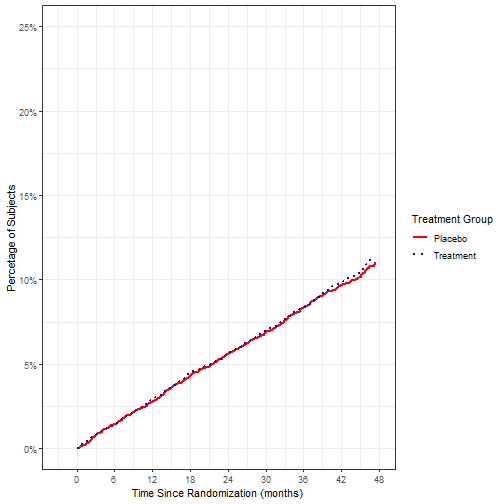
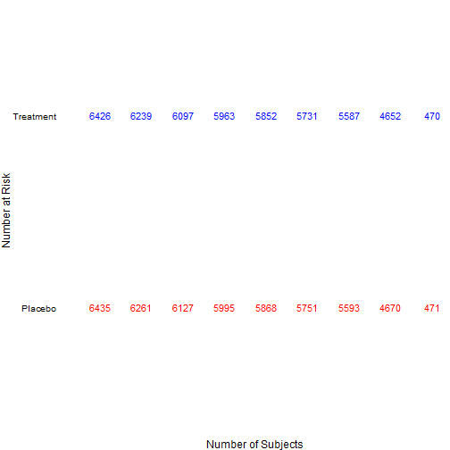
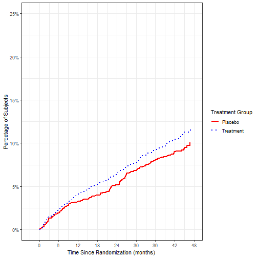

%\VignetteEngine{knitr::knitr}
%\VignetteIndexEntry{The km.plot and sync.ylab.widths functions}
%\VignetteDepends{tidyverse, figuRes2}

# Example 1: Juxtaposing two Kaplan-Meier graphics and their At Risk tables

Intialize a session:


```r
remove(list=ls())
require(figuRes2)
require(survival)
require(ggplot2)
require(plyr)
require(scales)
default.settings()
```

A data set included in the figuRes2 package is loaded. Note that this data contains one row per subject and has a censor column and a centime column.


```r
data(km.data)
working.df <- km.data
head(working.df)
```

```
##   CENTREID SUBJID AGE SEX    TRTGRP COUNTRY        REGION CENSOR CENTIME.DAY
## 1    58785      1  64   M Treatment  Canada North America      0        1504
## 2    58785      2  73   M Treatment  Canada North America      0        1534
## 3    58785      3  39   M   Placebo  Canada North America      0        1485
## 4    58785      4  63   M Treatment  Canada North America      0        1415
## 5    58785      5  59   M Treatment  Canada North America      0        1451
## 6    58785      6  73   M   Placebo  Canada North America      0        1469
##   CENTIME.MON
## 1    49.41273
## 2    50.39836
## 3    48.78850
## 4    46.48871
## 5    47.67146
## 6    48.26283
```

The Goal: Create Kaplan-Meier plots for Males and Females and juxtapose these.

## Create the graphic components

The km.plot function returns a list of objects.  The first two objects are ggplot objects for the Kaplan-Meier graphic and corresponding at risk table.


```r
km.M <- km.plot(parent.df = subset(working.df, SEX=="M"),
                censor.col = "CENSOR", 
                centime.col = "CENTIME.MON",
                category.col = "TRTGRP",
                category.palette = c("red", "blue"),
                at.risk.palette = c("red","blue"),                       
                linetype.palette = c("solid","dotted"), 
                x.label = "Time Since Randomization (months)", 
                x.limits=c(-3,48),
                x.ticks=seq(0,48,6),
                y.limits=c(0,.25), 
                y.ticks=seq(0,.25,.05))
```

```
## Warning: `guides(<scale> = FALSE)` is deprecated. Please use `guides(<scale> =
## "none")` instead.
```

Inspecting the Kaplan-Meier Graphic:

```r
km.M[[1]]
```



Inspecting the At Risk Table:

```r
km.M[[2]]
```



A similar call for the females:

```r
km.F <- km.plot(parent.df = subset(working.df, SEX=="F"),
                censor.col = "CENSOR", 
                centime.col = "CENTIME.MON",
                category.col = "TRTGRP",
                category.palette = c("red", "blue"),
                at.risk.palette = c("red","blue"),
                linetype.palette = c("solid","dotted"), 
                x.label = "Time Since Randomization (months)",
                x.limits=c(-3,48),
                x.ticks=seq(0,48,6),
                y.limits=c(0,.25), 
                y.ticks=seq(0,.25,.05))
```

```
## Warning: `guides(<scale> = FALSE)` is deprecated. Please use `guides(<scale> =
## "none")` instead.
```

First object:

```r
km.F[[1]]
```



Second object:

```r
km.F[[2]]
```


## Syncing the widths of the figures
In this step we combine tasks of aligning the y axes of the KM curves & tables. The sync.ylab.widths function takes a list of ggplot objects and returns a list of the same length contain gtable objects.  These can objects are different than ggplot objects.  They can be visually inspected with grid.draw (grid package) and can be processed by the build.page function (as this is merely a wrapper for the grid.arrange function (gridExtra package)).

In this example, the list of ggplot objects being supplied to sync.ylab.widths are manipulations of the graphs already reviewed.  In particular: 

* legends have been suppressed
* margins have been altered; use this to manipulate the space between graphics.
* tick mark colors have been changed


```r
comeback.M <- sync.ylab.widths(list(
  km.M[[1]]+
         ggtitle("Kaplan Meier-Plot of Time to\nFirst MACE: Males") +
    guides(color=F, linetype=F), 
  km.M[[2]]+labs(x=NULL, y="At Risk")
  ))
```

```
## Warning: `guides(<scale> = FALSE)` is deprecated. Please use `guides(<scale> =
## "none")` instead.
```

```r
comeback.F <- sync.ylab.widths(list(
  km.F[[1]]+
    ggtitle("Kaplan Meier-Plot of Time to\nFirst MACE: Females") +
    guides(color=F,linetype=F) +
    theme(axis.ticks.y=element_line(color="white")) + 
    labs(y=NULL) +
    scale_y_continuous(labels=NULL, limits=c(0,.25), breaks=seq(0,.25,.05)),
  km.F[[2]]+
    labs(x=NULL, y=NULL) +
    scale_y_discrete(labels=NULL))
  )
```

```
## Warning: `guides(<scale> = FALSE)` is deprecated. Please use `guides(<scale> =
## "none")` instead.
```

```
## Scale for 'y' is already present. Adding another scale for 'y', which will
## replace the existing scale.
```

## Assembling the page and discussion
One needs to iterate with minor changes until the final product is visually appealing. One needs to consider the dimensions allocated to the interior.h and interior.w below as well. E.g., this allocation seems to work well for the data set. However, if the treatment labels were shorter, the allocation of interior.w would need to change.  Similarly if more arms were included, more rows in the At Risk table would demand a different distribution of interior.h.  

In manipulating the plot margins keep in mind that overlapping graphics can obscure the edges of adjacent graphics/tables.  E.g., note above that c(-3, 48) was passed to x.limits instead of c(0, 48).  With the latter in use, portions of the text in the At Risk table were obscured.  


```r
build.page(interior.h = c(.8, .2),
           interior.w = c(.6,.4),
           ncol=2, nrow=2,
           interior = list(comeback.M[[1]], comeback.F[[1]],
                           comeback.M[[2]], comeback.F[[2]]))
```


```r
build.page(interior.h = c(.8, .2),
           interior.w = c(.5,.5),
           ncol=2, nrow=2,
           interior = list(comeback.M[[1]], comeback.F[[1]],
                           comeback.M[[2]], comeback.F[[2]]))
```


